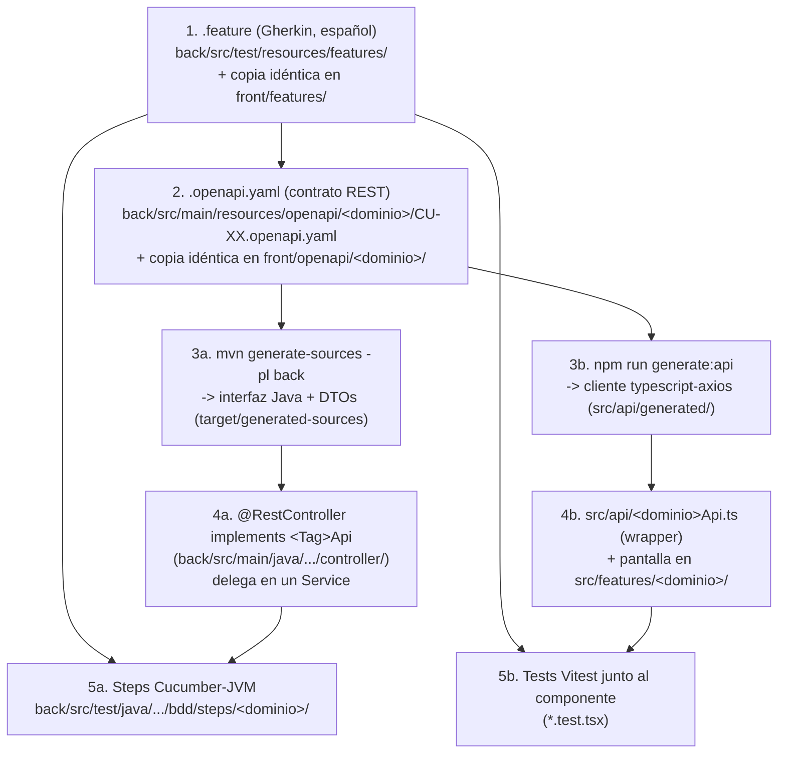

# Guía para agregar una funcionalidad (CU)

Esta guía es para quien recibe un `.feature` (Gherkin) y un `.openapi.yaml` y tiene que implementar el caso de uso (CU) correspondiente, o extender uno existente, siguiendo el patrón que ya usa `preinversion`/CU-PRE-01 de punta a punta.

Para entender **por qué** el proyecto está armado así (microservicios, Flowable), ver **[README.md](./README.md)**. Para levantar el stack en tu máquina, ver **[SETUP.md](./SETUP.md)**. Para la mecánica de generación de código (OpenAPI → Java/TypeScript) y cómo están organizadas las pruebas, ver **[REFERENCE.md](./REFERENCE.md)**. Esta guía asume que ya tenés el stack levantado y se enfoca solo en **cómo agregar tu CU**.

## TL;DR

1. Recibiste `back/src/test/resources/features/CU-XX-....feature` + `back/src/main/resources/openapi/<dominio>/CU-XX.openapi.yaml` (o los creaste vos siguiendo el patrón).
2. Implementás el back (controller → service → repository, pasás los steps de Cucumber).
3. Copiás ambos archivos, sin modificarlos, a `front/features/` y `front/openapi/<dominio>/`.
4. Implementás el front (cliente TS generado → wrapper → pantalla → tests Vitest).
5. Corrés el checklist de [Definition of Done](#definition-of-done) antes de abrir el PR.

## Antes de empezar

- Revisá si el CU ya está documentado en `back/src/main/java/sv/gob/mh/siip/model/<dominio>/TRAZABILIDAD-<DOMINIO>.md` — ahí están las entidades JPA que le corresponden y su origen.
- Mirá `preinversion`/CU-PRE-01 como referencia completa de punta a punta: `back/src/main/resources/openapi/preinversion/CU-PRE-01.openapi.yaml`, `back/src/main/java/sv/gob/mh/siip/controller/PreinversionController.java`, `back/src/test/java/sv/gob/mh/siip/bdd/steps/preinversion/`, `front/src/api/preinversionApi.ts`, `front/src/features/preinversion/proyectos/`.
- El `.feature` y el `.openapi.yaml` que te entregan son el contrato ya acordado — no los reinterpretes ni les cambies el alcance por tu cuenta. Si algo del contrato no te cierra o te parece incompleto, avisá antes de implementar (escribile a david@magnaperitia.com); no lo resuelvas a tu criterio en el código, porque el `.feature`/`.openapi.yaml` también existe en el otro módulo (back o front) y quedarían desincronizados.
- Si un término del `.feature` (un rol, una sigla, un estado) no te queda claro, revisá primero [GLOSSARY.md](./GLOSSARY.md) antes de preguntar — es el glosario acordado con negocio.

## Qué podés tocar y qué no

✅ Podés tocar:
- Tu `.feature` (si te toca escribirlo) y su copia idéntica en el otro módulo.
- Tu `.openapi.yaml` y su copia idéntica en el otro módulo.
- El `@RestController`/`Service`/`Repository` de tu dominio en `back`.
- Tu wrapper `<dominio>Api.ts` y tu pantalla en `front/src/features/<dominio>/`.
- Los steps de Cucumber de tu dominio en `back/src/test/java/.../bdd/steps/<dominio>/`.

🚫 No toques:
- Código generado: `back/target/generated-sources/`, `front/src/api/generated/`. Se regenera solo; si lo editás a mano, se pierde en el próximo build.
- `.feature`/`.openapi.yaml` de otros dominios/CUs.
- `RunCucumberTest.java` y `CucumberSpringConfiguration.java` — recogen los steps automáticamente, no necesitan cambios.
- El `httpClient.ts` genérico del front — cada wrapper de dominio instancia el cliente generado con `createHttpClient('/back')` propio (ver nota en `preinversionApi.ts`); no reutilices el `httpClient` genérico, porque el cliente generado ignora su `basePath` si el axios que recibe ya trae `baseURL` distinto.

## Convención de branches y commits

- Nombrá la branch con el código del CU: `feature/CU-PRE-02-editar-proyecto`.
- El título del PR debe incluir el código del CU (ej. `CU-PRE-02: editar proyecto — back + front`).
- Si el back y el front del mismo CU van en PRs separados, referenciá el PR del otro módulo en la descripción para que quien revisa pueda ver ambos lados del contrato.
- Esto es lo que permite cruzar cada cambio con su entrada en `TRAZABILIDAD-<DOMINIO>.md` y evitar que dos personas toquen el mismo dominio sin darse cuenta.

## El flujo completo, de un vistazo



Los `.feature` son la **especificación funcional** (qué debe hacer el sistema, en lenguaje de negocio) y los `.openapi.yaml` son el **contrato técnico** (cómo se comunican back y front). Ambos se escriben **una sola vez** y se copian, sin modificar su contenido, a los dos módulos. No hay ningún script que los mantenga sincronizados automáticamente: la disciplina de copiarlos es manual.

## Parte 1 — Backend (`back`)

1. **Escribí (o ubicá) el `.feature`** en `back/src/test/resources/features/`. Un archivo por escenario/sub-flujo relacionado, prefijado con el código del CU (ej. `CU-PRE-01-solicitar-cup.feature`). Un solo `Feature:`/`Característica:` por archivo — ver [reglas de Gherkin](#reglas-de-gherkin-a-respetar) más abajo. Si algún escenario todavía no se va a implementar, etiquetalo `@wip` para que quede excluido de la ejecución.
2. **Definí el contrato REST** en `back/src/main/resources/openapi/<dominio>/CU-XX.openapi.yaml` (creá el archivo si el CU es nuevo): `paths`, `operationId`, `tags` (el tag define el nombre de la interfaz Java generada) y los `schemas` en `components/schemas`.
3. El plugin genera a partir de un archivo puntual por `<execution>` (no de un directorio completo), así que **todo `.yaml` nuevo necesita su propia `<execution>`** en el `openapi-generator-maven-plugin` de `back/pom.xml` — sea CU nuevo en un dominio existente o dominio nuevo. Copiá una `<execution>` existente y cambiá:
   - `id`: único por execution (ej. `generate-preinversion-cu02-api`).
   - `inputSpec`: apuntando a tu `CU-XX.openapi.yaml`.
   - `apiPackage`/`modelPackage`: **solo si es un dominio nuevo**. Si tu CU es del mismo dominio que uno ya existente (ej. otro CU de `preinversion`), reutilizá los mismos `apiPackage`/`modelPackage` — el generador agrega ahí las interfaces/modelos nuevos sin pisar los existentes. ver ejemplo con CU-01
4. Generá la interfaz Java y los DTOs:
   ```
   mvn generate-sources -pl back
   ```
5. Implementá (o extendé) el `@RestController` que `implements` esa interfaz, delegando en un `Service` real — ver `PreinversionController.java`. Con `skipDefaultInterface=true`, si falta implementar un método nuevo **no compila**, es intencional.
6. Implementá la lógica de negocio en el `Service`/`Repository` correspondientes bajo `back/src/main/java/sv/gob/mh/siip/model/<dominio>/`. Si tu CU necesita columnas o tablas nuevas, alcanza con modelarlas en la entidad JPA — el esquema se recrea solo (ver [nota sobre `ddl-auto` en SETUP.md](./SETUP.md#configuración-de-esquema-por-perfil)); no hace falta escribir ninguna migración.
7. Volvé al `.feature`: quitale `@wip` a cada escenario que ya podés implementar, corré la suite (`mvn test -pl back -Dtest=RunCucumberTest`) para que Cucumber imprima el stub Java en consola ("You can implement these steps using the snippet(s) below"), y pegá ese stub en la clase de steps correspondiente bajo `back/src/test/java/sv/gob/mh/siip/bdd/steps/<dominio>/`, reemplazando `PendingException` por la implementación real (usando los beans `@Autowired` del contexto Spring de test).
8. Corré `mvn verify` (o `mvn test -pl back -Dtest=RunCucumberTest` para solo BDD) hasta que todos los escenarios pasen en verde.

## Parte 2 — Frontend (`front`)

1. **Copiá el mismo `.feature`** (sin modificarlo) a `front/features/`. Es la misma especificación que ya cumplió el back — le sirve al front como guía de qué pantallas/mensajes/validaciones implementar.
2. **Copiá el `.openapi.yaml`** actualizado del back a `front/openapi/<dominio>/CU-XX.openapi.yaml` (idéntico al de `back/src/main/resources/openapi/`).
3. Generá el cliente TypeScript:
   ```
   npm run generate:api
   ```
   (para un dominio nuevo, agregá antes un script `generate:api:<dominio>` en `front/package.json`, análogo al existente, apuntando a `openapi/<dominio>/CU-XX.openapi.yaml` y `-o src/api/generated/<dominio>`).
4. Creá (o extendé) el wrapper `front/src/api/<dominio>Api.ts`: instanciá las clases generadas (una por `tag` del yaml) pasándoles `createHttpClient('/back')`. Reexportá ahí los tipos (`Dto`s) que la UI necesite.
5. Implementá la pantalla/componente en `front/src/features/<dominio>/<caso-de-uso>/`, siguiendo el patrón de `features/preinversion/proyectos/`: `react-hook-form` + un schema `zod` en `<algo>FormSchema.ts`, reutilizando los componentes genéricos de `src/components/form/` (`FormRow`, `DatePickerInput`) y `src/components/table/` (`DataTable`, `Pagination`) donde aplique.
6. Conectá la ruta/menú si hace falta (reemplazando el placeholder "🚧 Página en Construcción" del módulo correspondiente en el sidebar/routing).
7. Escribí los tests junto al componente (`*.test.tsx`, Vitest + React Testing Library), cubriendo al menos el camino feliz y las validaciones descritas en el `.feature`. Si el equipo decide automatizar el `.feature` con `cucumber-js`, los steps van en `front/features/step_definitions/<dominio>/`.
8. Validá todo:
   ```
   npm run lint
   npm run test
   npm run build
   ```

## Reglas de Gherkin a respetar

- **Un solo `Feature:` por archivo `.feature`.** Un archivo puede tener varios `Scenario:`/`Scenario Outline:`, pero *no* varios `Feature:` — si se necesita agrupar varios casos de uso relacionados, van en archivos separados con el mismo prefijo (ej. `CU-PRE-01.feature`, `CU-PRE-01-solicitar-cup.feature`, `CU-PRE-01-editar-proyecto.feature`...). Meter dos `Feature:` en el mismo archivo rompe el parseo de **todo** el módulo (`TestEngine with ID 'cucumber' failed to discover tests`) y tumba el build completo, no solo ese archivo.
- Los `.feature` pueden escribirse en español anteponiendo `# language: es` como primera línea (usa `Característica/Escenario/Dado/Cuando/Entonces`) o dejarse en inglés (`Feature/Scenario/Given/When/Then`) sin esa línea — no mezclar ambos dentro del mismo archivo.
- **Desde Cucumber 6+ ya no existe el modo "no estricto":** un paso `undefined` (sin step definition) o `pending` (con `PendingException`) **siempre hace fallar el build**, no solo se reporta. Si acabas de agregar un `.feature` nuevo sin implementar todavía sus steps, `mvn verify`/`mvn test` va a fallar apenas lo agregues — es esperado, no un bug.
- `back/src/test/resources/features/*.feature` y `front/features/*.feature` deben mantenerse **idénticos** — al editar un escenario, actualizá el archivo en ambos lados.

**Flujo para agregar un `.feature` como especificación antes de implementarlo:**

1. Escribí el `.feature` normalmente.
2. Etiquétalo con `@wip` (a nivel de `Característica:` si ningún escenario está implementado todavía, o solo en los `Escenario:` puntuales que aún faltan) — `RunCucumberTest` está configurado con `cucumber.filter.tags = "not @wip"`, así que todo lo etiquetado `@wip` queda **excluido** de la ejecución (aparece como `Skipped`, no como error) hasta que le quites el tag.
3. Corré la suite una vez (fallará con `UndefinedStepException`, es el paso que genera los stubs) o, si ya lo etiquetaste `@wip`, simplemente confirmá que corre en verde con los escenarios nuevos en `Skipped`.
4. Para implementar un escenario: quitale el `@wip`, corré la suite — Cucumber imprime en consola, bajo "You can implement these steps using the snippet(s) below:", el stub Java listo para copiar. Pegalo en la clase de steps correspondiente y ve reemplazando el `PendingException` por la implementación real, step por step.

## Puntos que suelen confundir a alguien nuevo

- El `.feature` y el `.openapi.yaml` están **duplicados a propósito** en `back` y `front` — no hay generación cruzada entre módulos ni symlinks. Si editás uno, editá el otro a mano.
- El código generado (interfaces Java en `back/target/generated-sources/`, cliente TS en `front/src/api/generated/`) **nunca se edita a mano** y **nunca se versiona** — se regenera en cada build/`npm run generate:api`.
- Un `.feature` nuevo sin implementar hace fallar `mvn test`/`mvn verify` en `back` a menos que lo etiquetes `@wip` — no es un bug, es la señal de que falta implementar esos steps.
- Un método nuevo en el `.yaml` que no se implementó en el `@RestController` rompe la compilación de `back` (por diseño, `skipDefaultInterface=true`) — es la forma de detectar contratos a medio implementar antes de llegar a runtime.
- No hace falta preocuparse por migraciones de base de datos por ahora: agregar un campo a una entidad JPA alcanza, el esquema se recrea solo (ver nota en [SETUP.md](./SETUP.md#configuración-de-esquema-por-perfil)).

## Definition of Done

Antes de abrir el PR, confirmá:

```
[ ] back: mvn verify pasa (BDD en verde; nada quedó @wip que debiera estar implementado)
[ ] back: el @RestController implementa 100% de la interfaz generada (compila sin métodos faltantes)
[ ] front: npm run lint pasa
[ ] front: npm run test pasa
[ ] front: npm run build pasa
[ ] .feature idéntico en back/src/test/resources/features/ y front/features/
[ ] .openapi.yaml idéntico en back/src/main/resources/openapi/ y front/openapi/
[ ] branch/PR nombrados con el código del CU
[ ] TRAZABILIDAD-<DOMINIO>.md revisado/actualizado si el CU agregó entidades nuevas
```