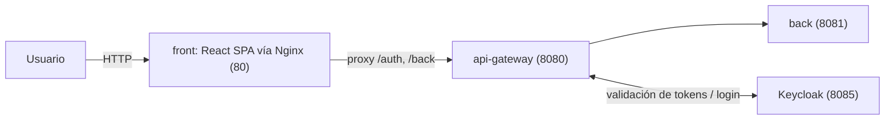

# SIIP

Sistema de Información de Inversión Pública del Ministerio de Hacienda de El Salvador. Gestiona el ciclo de vida de proyectos de inversión pública (preinversión, catálogos administrativos, usuarios/roles y flujos de aprobación) mediante una arquitectura de microservicios sobre Spring Boot / Spring Cloud.

## Mapa de documentación

Este README explica **qué es el sistema y cómo está armado**. El resto de la documentación está separada por objetivo:

| Documento | Para qué sirve |
|---|---|
| [SETUP.md](./SETUP.md) | Levantar el stack: requisitos, variables de entorno, comandos de build/despliegue, accesos una vez arriba. Empezá por acá si es tu primer día. |
| [REFERENCE.md](./REFERENCE.md) | Referencia técnica: cómo funciona la generación de código desde OpenAPI (back y front), estructura del front, y cómo están organizadas las pruebas (unitarias, cobertura, BDD). |
| [CONTRIBUTING.md](./CONTRIBUTING.md) | Cómo agregar una funcionalidad (CU) nueva a partir de un `.feature` + `.openapi.yaml`: pasos, convenciones, checklist de entrega. |
| [GLOSSARY.md](./GLOSSARY.md) | Glosario de términos del dominio (roles, siglas, estados) usados en los `.feature`/`.openapi.yaml` de cada CU. |

Si te asignaron un CU para implementar, andá directo a **CONTRIBUTING.md** — ahí también hay links de vuelta a este README y a REFERENCE.md para el contexto que necesites en el camino.

Si algo no te queda claro (del código, de un término de negocio, del contrato de un CU), escribile primero a david@magnaperitia.com antes de resolverlo a tu criterio.

## Arquitectura

El proyecto es un **multi-módulo Maven** (`pom.xml` raíz de tipo `pom`) compuesto por los siguientes microservicios:

| Módulo | Puerto | Descripción |
|---|---|---|
| `api-gateway` | 8080 | Spring Cloud Gateway (WebFlux). Enruta las peticiones externas hacia `back`, aplica seguridad OAuth2/OIDC contra Keycloak, `TokenRelay`, *Circuit Breaker* y *Retry*, y expone `/auth/login`/`/auth/refresh` (con sus propios DTOs `LoginRequest`/`TokenResponse`, package `sv.gob.mh.siip.api_gateway.dto`) contra el token endpoint de Keycloak. Expone Swagger UI agregado. |
| `back` | 8081 (solo interno) | Backend único del sistema: catálogos (departamentos, municipios, distritos, sectores, etapas, componentes ambientales, tablas de rangos, catálogos generales), gestión de usuarios/roles/permisos/grupos/objetos protegidos, gestión de proyectos, procesos de preinversión y **motor de workflow (Flowable BPM)** para el registro/aprobación de proyectos. Incluye sus propios DTOs/enums/utilidades (`sv.gob.mh.siip.dto`, `.enums`, `.util`) — antes vivían en el módulo `siip-comun`, fusionado aquí porque ya era su único consumidor real. No tiene Spring Security propio: confía en que solo `api-gateway` lo invoque, por eso no publica su puerto al host. |
| `front` | 80 (interno 8080) | SPA en **React + Vite (TypeScript)**, servida en producción por **Nginx**. Nginx actúa como reverse-proxy same-origin de `/auth/**` y `/back/**` hacia `api-gateway` (evita tener que habilitar CORS); el login se autentica contra Keycloak a través de `api-gateway`. No es un módulo Maven — se compila con npm/Vite dentro de su propio `Dockerfile` (multi-stage: build Node + imagen Nginx). |
| `postgres` | 5432 | Base de datos PostgreSQL, con esquema de negocio (`public`) y esquema de Flowable (`flowable`). |
| `keycloak` | 8085 | Proveedor de identidad (OIDC) para autenticación/autorización de usuarios y del propio API Gateway. |

Todos los servicios comparten la red Docker `microred` y `back` espera a que `postgres` esté *healthy* antes de arrancar.

### Flujo de una petición

El navegador solo habla con `front` (un único origen); es Nginx quien reenvía `/auth/**` y `/back/**` hacia `api-gateway` dentro de la red Docker. En desarrollo local (`npm run dev`), el servidor de Vite cumple ese mismo rol de proxy (ver [SETUP.md](./SETUP.md) para levantarlo).

### Motor de procesos (Flowable)

El módulo `back` incluye Flowable embebido. El proceso `Proceso_SIIF.bpmn20.xml` (`back/src/main/resources/processes`) modela el ciclo de vida completo del proyecto (registro → CUP → formulación → viabilidad → elegibilidad → opinión técnica → cierre), pero **solo el tramo de CU-PRE-01 está conectado al código real** — el resto del BPMN (a partir de la revisión/emisión del CUP por el Técnico PRE, CU-PRE-01.5 en adelante) es hoy un diagrama de referencia sin caso de uso implementado detrás:

- `ProyectoServiceImpl.registrar()` arranca una instancia del proceso (`businessKey` = id del proyecto), que queda esperando en la userTask "Registro de Proyecto y Solicitud de CUP".
- `ProyectoServiceImpl.solicitarCup()` completa esa tarea, avanzando el proceso a la userTask de revisión del Técnico PRE (donde queda detenido hasta que exista CU-PRE-01.5).
- `ProyectoServiceImpl.eliminar()` y el archivado automático de `AlertaEliminacionAutomaticaScheduler` cancelan la instancia de proceso del proyecto.
- `ProyectoServiceImpl.responderObservacionCup()` sigue siendo JPA puro (no toca Flowable): hoy nada real puede llevar un proyecto a `OBSERVADO_DGICP_REGISTRO` sin CU-PRE-01.5, así que no hay ninguna tarea de Flowable legítima que completar ahí todavía.
- Todas estas llamadas a Flowable toleran que no exista una instancia/tarea asociada (no hacen nada) — pasa con datos creados fuera del flujo real (fixtures de prueba); en producción, todo proyecto pasa por `registrar()` y siempre tiene una.
- Esquema de Flowable aislado en `flowable` (`flowable.databaseSchema`), separado del esquema de negocio.
- En arranque, `SiipApplication` imprime por consola el número de definiciones de proceso y tareas activas (útil para verificar que el motor cargó correctamente).
- Para inspeccionar procesos/tareas con la consola oficial de Flowable UI, ver [SETUP.md](./SETUP.md#herramienta-externa-flowable-ui-opcional).

## Base de datos: Postgres en local, Oracle en producción

`back` no tiene el driver ni la URL de base de datos hardcodeados — todo sale de variables de entorno (`DB_URL`/`DB_DRIVER_CLASS_NAME`/`DB_SCHEMA`), así que el mismo jar sirve para Postgres (local, vía Docker Compose) o Oracle (producción). Detalle de las variables y prerrequisitos operativos en [SETUP.md](./SETUP.md#base-de-datos-postgres-en-local-oracle-en-producción).