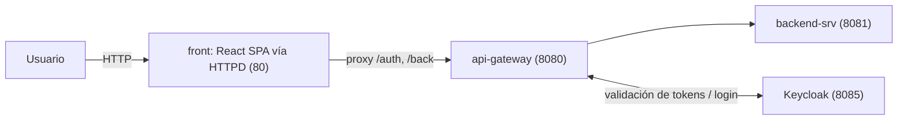

# SIIP

Sistema de Información de Inversión Pública del Ministerio de Hacienda de El Salvador. Gestiona el ciclo de vida de proyectos de inversión pública (preinversión, catálogos administrativos, usuarios/roles y flujos de aprobación) mediante una arquitectura de microservicios sobre Spring Boot / Spring Cloud.

## Mapa de documentación

Este README explica **qué es el sistema y cómo está armado**. El resto de la documentación está separada por objetivo:

| Documento | Para qué sirve |
|---|---|
| [SETUP.md](./SETUP.md) | Levantar el stack: requisitos, variables de entorno, comandos de build/despliegue, accesos una vez arriba. Empezá por acá si es tu primer día. |
| [REFERENCE.md](./REFERENCE.md) | Referencia técnica: índice hacia la documentación de cada componente (`backend-srv/docs/`, `front/docs/`: OpenAPI, pruebas, BDD, Flowable), más lo que cruza componentes (contratos duplicados back↔front, `api-gateway`, SonarQube local). |
| [CONTRIBUTING.md](./CONTRIBUTING.md) | Cómo agregar una funcionalidad (CU) nueva a partir de un `.feature` + `.openapi.yaml`: pasos, convenciones, checklist de entrega. |
| [GLOSSARY.md](./GLOSSARY.md) | Glosario de términos del dominio (roles, siglas, estados) usados en los `.feature`/`.openapi.yaml` de cada CU. |

Si te asignaron un CU para implementar, andá directo a **CONTRIBUTING.md** — ahí también hay links de vuelta a este README y a REFERENCE.md para el contexto que necesites en el camino.

Si algo no te queda claro (del código, de un término de negocio, del contrato de un CU), escribile primero a david@magnaperitia.com antes de resolverlo a tu criterio.

## Arquitectura

El proyecto se compone de los siguientes microservicios. `backend-srv`, `api-gateway` y `front` son proyectos **independientes** (cada uno con su propio repositorio en la entidad): no hay `pom.xml` agregador en la raíz, así que `backend-srv` y `api-gateway` se compilan cada uno dentro de su carpeta.

| Módulo | Puerto | Descripción |
|---|---|---|
| `api-gateway` | 8080 | Spring Cloud Gateway (WebFlux). Enruta las peticiones externas hacia `backend-srv`, aplica seguridad OAuth2/OIDC contra Keycloak, `TokenRelay`, *Circuit Breaker* y *Retry*, y expone `/auth/login`/`/auth/refresh` (con sus propios DTOs `LoginRequest`/`TokenResponse`, package `sv.gob.mh.siip.api_gateway.dto`) contra el token endpoint de Keycloak. Expone Swagger UI agregado. |
| `backend-srv` | 8081 (solo interno) | Backend único del sistema: catálogos (departamentos, municipios, distritos, sectores, etapas, componentes ambientales, tablas de rangos, catálogos generales), gestión de usuarios/roles/permisos/grupos/objetos protegidos, gestión de proyectos, procesos de preinversión y **motor de workflow (Flowable BPM)** para el registro/aprobación de proyectos. Incluye sus propios DTOs/enums/utilidades (`sv.gob.mh.siip.dto`, `.enums`, `.util`) — antes vivían en el módulo `siip-comun`, fusionado aquí porque ya era su único consumidor real. No tiene Spring Security propio: confía en que solo `api-gateway` lo invoque, por eso no publica su puerto al host. |
| `front` | 80 (interno 8080) | SPA en **React + Vite (TypeScript)**. Se sirve con **Apache HTTPD** sobre UBI 9 (`front/Dockerfile`, el mismo en local y en la entidad), que actúa como reverse-proxy same-origin de `/auth/**` y `/back/**` hacia `api-gateway` (evita tener que habilitar CORS). El `Dockerfile` solo empaqueta `dist/`: en la entidad lo compila el pipeline y en local el servicio `front-build` de `docker-compose.yml`. El login se autentica contra Keycloak a través de `api-gateway`. No es un proyecto Maven. |
| `postgres` | 5432 | Base de datos PostgreSQL, con esquema de negocio (`public`) y esquema de Flowable (`flowable`). |
| `keycloak` | 8085 | Proveedor de identidad (OIDC) para autenticación/autorización de usuarios y del propio API Gateway. |

Todos los servicios comparten la red Docker `microred` y `backend-srv` espera a que `postgres` esté *healthy* antes de arrancar.

`backend-srv-config` no es un servicio: es el repositorio (`dgicp-siip2/backend-srv-config`) con el chart Helm que despliega `backend-srv` en los ambientes de la entidad y guarda su configuración por ambiente (base de datos, esquemas, logging, recursos). En local esa misma configuración la dan `.env` y `docker-compose.yml`. Ver [SETUP.md § Configuración por ambiente](./SETUP.md#configuración-por-ambiente-en-la-entidad-backend-srv-config).

> El prefijo público `/back/**` (front → api-gateway) **no** cambió con el renombre de la carpeta a `backend-srv`: es parte del contrato con `front` (basePath de los clientes generados). api-gateway lo reescribe hacia `BACKEND_SRV_URL` (por defecto `http://backend-srv:8081`).

### Flujo de una petición

```mermaid
flowchart LR
    Usuario -->|HTTP| Front["front: React SPA vía HTTPD (80)"]
    Front -->|proxy /auth, /back| Gateway["api-gateway (8080)"]
    Gateway --> Back["backend-srv (8081)"]
    Gateway <-->|validación de tokens / login| Keycloak["Keycloak (8085)"]
```

El navegador solo habla con `front` (un único origen); es su Apache HTTPD quien reenvía `/auth/**` y `/back/**` hacia `api-gateway` dentro de la red Docker. En desarrollo local (`npm run dev`), el servidor de Vite cumple ese mismo rol de proxy (ver [SETUP.md](./SETUP.md) para levantarlo).

### Motor de procesos (Flowable)

`backend-srv` incluye Flowable embebido. El proceso `Proceso_SIIF.bpmn20.xml` modela el ciclo de vida completo del proyecto (registro → CUP → formulación → viabilidad → elegibilidad → opinión técnica → cierre), pero **solo el tramo de registro y solicitud de CUP está conectado al código**:

- Registrar el proyecto (CU-PRE-01) arranca una instancia del proceso; solicitar el CUP completa su primera tarea.
- **Emitir el CUP (CU-PRE-01.5) cancela la instancia**, igual que eliminar o archivar automáticamente el proyecto.
- Nada en el sistema lee las tareas de Flowable: las bandejas y el avance se basan en los estados de las entidades. El resto del BPMN es un diagrama de referencia; si Flowable pasa a ser el motor real de tareas es una decisión pendiente.
- Usa su propio esquema (`flowable`), separado del de negocio.

El detalle (qué clase hace cada llamada, tolerancia a proyectos sin instancia, verificación al arrancar) está en [backend-srv/docs/desarrollo.md § Motor de procesos](./backend-srv/docs/desarrollo.md#motor-de-procesos-flowable). Para inspeccionar procesos y tareas con la consola oficial de Flowable UI, ver [SETUP.md](./SETUP.md#herramienta-externa-flowable-ui-opcional).

## Base de datos: Postgres en local, Oracle en producción

`backend-srv` no tiene el driver ni la URL de base de datos hardcodeados — todo sale de variables de entorno (`DB_URL`/`DB_DRIVER_CLASS_NAME`/`DB_SCHEMA`), así que el mismo jar sirve para Postgres (local, vía Docker Compose) o Oracle (producción). Detalle de las variables y prerrequisitos operativos en [SETUP.md](./SETUP.md#base-de-datos-postgres-en-local-oracle-en-producción).