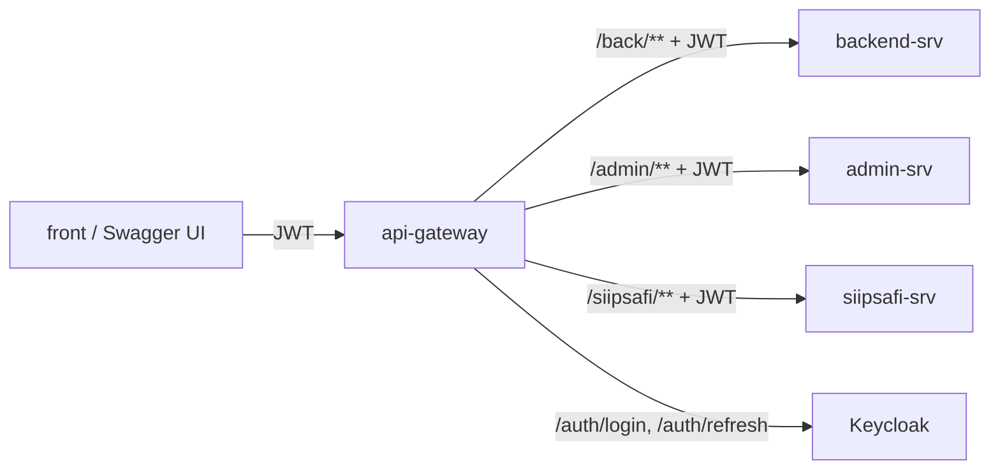

# Arquitectura

## Rutas

Definidas en `application.yml` (`spring.cloud.gateway.server.webflux.routes`). Cada ruta quita el
prefijo (`RewritePath`) y el header `Cookie` antes de reenviar:

| Ruta | Predicado | Destino |
|---|---|---|
| `backend-srv` | `/back/**` | `${BACKEND_SRV_URL}` |
| `admin-srv` | `/admin/**` | `${ADMIN_SRV_URL}` |
| `siipsafi-srv` | `/siipsafi/**` | `${SIIPSAFI_SRV_URL}` |

El prefijo `/back/**` es contrato con el front: no cambia aunque el servicio se llame backend-srv.

## Seguridad

`SecurityConfig` exige un JWT válido en todo salvo:

- Swagger UI y los `v3/api-docs` de cada servicio;
- `/auth/**` (login y refresh) y `/error/**`;
- `/actuator/health/**`, para los probes del chart. Solo `health`, sin detalles.

El gateway no autoriza por rol: cada servicio valida el token por su cuenta y aplica su propio
modelo de permisos. `TokenRelay` (filtro por defecto) les pasa el token del cliente tal cual.

## Componentes propios

| Clase | Qué hace |
|---|---|
| `AuthController` | `/auth/login` y `/auth/refresh`: obtiene tokens del endpoint de Keycloak con el cliente confidencial. |
| `FallbackController` | `/fallback/back`: mensaje de "servicio no disponible". Hoy ninguna ruta lo usa (no hay `CircuitBreaker` configurado). |
| `CustomHeaderFilter` | Agrega `X-Gateway-Info` a las respuestas. |
| `GatewayAuditoriaAspect` | Log de entrada y salida de los controladores, omitiendo los argumentos `@ArgumentosSensibles`. |
| `ReactiveJwtAuthConverter` | Convierte los roles del JWT (`realm_access`) en authorities. |
