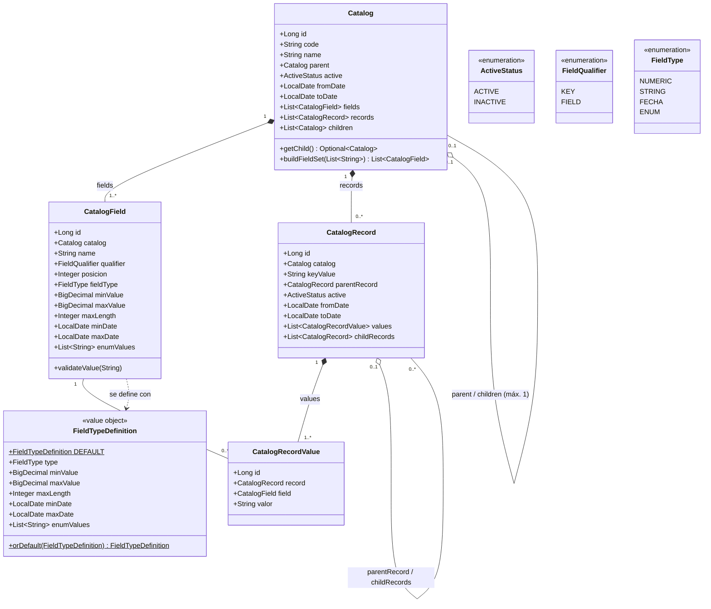

# Modelo de Dominio — Administración de Catálogos

Basado en `CU-ADM-01-Administracion-de-Catalogos.md` **versión 1.3**. Cubre la
gramática `catalogMaster`, las reglas de negocio RN-01 a RN-25, los
subflujos SF-01 a SF-15, las excepciones E-01 a E-25 y las 16 historias de
usuario asociadas.

> Las referencias a reglas usan la numeración del caso de uso (`RN-xx`), las
> excepciones sus códigos (`E-xx`) y los supuestos sus identificadores
> (`S-xx`).

## 1. Visión general del dominio

El dominio se organiza alrededor de cuatro entidades y un objeto valor:

| Concepto | Descripción | Reglas cubiertas |
|---|---|---|
| **Catalog** | Catálogo maestro: código, nombre, padre, hijo, estado, vigencia y campos. | RN-02, RN-03, RN-05, RN-06, RN-09, RN-10, RN-12, RN-13, RN-14, RN-15, RN-16, RN-17, RN-19, RN-20, RN-21, RN-22, RN-23 |
| **CatalogField** | Definición de un campo (`KEY` o `FIELD`), con su tipo y posición. | RN-03, RN-04, RN-11, RN-20, RN-21 |
| **FieldTypeDefinition** | Objeto valor (no persistente) con el tipo y sus parámetros: NUMERIC {mín:máx}, STRING {n}, FECHA {desde:hasta}, ENUM {lista}. Define el tipo por defecto `STRING {80}` para los campos sin tipo. | RN-04, S-09 |
| **CatalogRecord** | Registro de datos maestros; si su catálogo tiene padre, referencia un registro padre del catálogo padre. | RN-01, RN-05, RN-06, RN-07, RN-08, RN-11, RN-12, RN-14, RN-15, RN-16, RN-18, RN-24 |
| **CatalogRecordValue** | Valor (STRING) de un campo dentro de un registro. | RN-01, RN-11, RN-18 |

`catalogMaster` es la colección raíz (repositorio) de todos los `Catalog`.

### Cambios respecto a v3.0

| Tema | v3.0 (CU v1.2) | v3.1 (CU v1.3) |
|---|---|---|
| Campo sin tipo | El tipo era obligatorio. | Se asigna `STRING {80}` (RN-04): `FieldTypeDefinition.DEFAULT` y `FieldTypeDefinition.orDefault()`, aplicados por `CatalogField` al crearse y al redefinirse. El valor por defecto se **guarda** como STRING{80} explícito (S-09): no cambia el esquema ni la lectura. |

### Cambios respecto a v2.0

| Tema | v2.0 | v3.0 (CU v1.2) |
|---|---|---|
| Tipo de campo | No modelado. | `CatalogField.fieldType` + parámetros (`minValue`, `maxValue`, `maxLength`, `minDate`, `maxDate`, `enumValues`); validación de definición (E-05) y de valores (E-14). |
| Campo KEY | Al menos uno. | **Exactamente uno** (RN-03, E-03, E-23). |
| Posición | Sin restricción. | Entero positivo único por catálogo (S-05). |
| Hijos de un catálogo | `0..*`. | **Como máximo uno** (RN-05, E-07); se conserva la colección `children` y se expone `getChild()`. |
| Valor KEY | Solo en `CatalogRecordValue`. | Además en `CatalogRecord.keyValue`, único por catálogo (S-06, E-17). |
| Inactivación | Sin cascada. | Cascada catálogo → registros → catálogo hijo (RN-06) y registro → registros hijos (RN-14), recursiva. |
| Reactivación | No modelada. | `Catalog.reactivate()` (SF-06, E-15, E-16) y `CatalogRecord.reactivate()` (SF-09, E-20). Sin cascada (S-03). |
| Creación de registros | Sin validar estado. | Prohibida en catálogo INACTIVE (E-13); registro padre debe existir y estar ACTIVE (E-18). |
| Registros hijos sin catálogo hijo | Error (`requireChildRecords()`). | Resultado vacío (SF-13); se retira `requireChildRecords()`. |
| Estado efectivo | El estado del catálogo dominaba en lectura (antigua regla 12). | Las cascadas mantienen el estado persistido consistente; `effectiveStatus(today)` deriva además el estado por fechas aún no procesadas por el planificador (SF-14). |
| Conjunto de campos | Fuera del modelo. | `Catalog.buildFieldSet()` (algoritmo 4.1, E-21). |
| Fecha actual | `LocalDate.now()` dentro de las entidades. | Se recibe como parámetro `today` (reloj del sistema, precondición 3). |
| Errores | `IllegalArgumentException` / `IllegalStateException`. | `CatalogDomainException` con el código `E-xx` del caso de uso. |

### 1.1 Diagrama de clases



### 1.2 Invariantes de dominio (independientes de la capa de persistencia)

Se validan en las entidades (agregado) o en el servicio de aplicación; el
ORM y el esquema solo garantizan integridad estructural (FK, unicidad,
not-null y los `CHECK` de un solo registro).

- **RN-20 / RN-03**: un `Catalog` tiene al menos un `CatalogField` (E-02) y
  **exactamente uno** con `qualifier = KEY` (E-03, E-23).
- **RN-04**: los `CatalogField.name` de un catálogo son distintos (E-04,
  `uk_catalog_field_name`); la definición de tipo es consistente (E-05):
  NUMERIC `a ≤ b`, STRING `n > 0`, FECHA `d1 ≤ d2`, ENUM no vacío y sin
  duplicados.
- **RN-04 / S-09**: un campo sin tipo se define como `STRING {80}`
  (`FieldTypeDefinition.DEFAULT`). El valor por defecto se aplica solo cuando
  no se indica tipo (`type == null`); un tipo indicado sin sus parámetros es
  inconsistente (E-05). Por lo tanto todo `CatalogField` persistido tiene
  `fieldType` informado.
- **S-05**: posiciones enteras positivas y únicas por catálogo
  (`uk_catalog_field_posicion`).
- **RN-21**: los campos solo pueden modificarse si `records` está vacío (E-12).
- **RN-05**: un catálogo tiene como máximo un hijo (E-07,
  `uk_catalog_parent`); la jerarquía no admite ciclos (E-08); solo se
  vincula a un padre ACTIVE (E-15). Si `catalog.parent != null`, todo
  `CatalogRecord` de ese catálogo tiene `parentRecord != null` y
  `parentRecord.catalog == catalog.parent` (E-18); si el catálogo es plano,
  `parentRecord == null`.
- **S-06**: el valor KEY es único dentro de su catálogo (E-17,
  `uk_catalog_record_key`).
- **RN-11**: un registro tiene un valor por cada campo del catálogo, guardado
  como STRING y validado contra tipo y rango (E-14).
- **RN-18 / RN-19**: `Catalog.code` y el valor KEY (`CatalogRecord.keyValue`
  y su `CatalogRecordValue`) son inmutables (E-11, E-19).
- **RN-15 / RN-16 / RN-12 / S-02**: sin fechas ⇒ ACTIVE; TO DATE ≤ hoy ⇒
  INACTIVE (la fecha prevalece sobre el estado solicitado); fijar INACTIVE
  ⇒ TO DATE = hoy. Por lo tanto **INACTIVE ⇒ TO DATE informada**
  (`ck_*_inactive_to_date`) y **ACTIVE ⇒ TO DATE vacía o futura**.
- **RN-06 / RN-14**: catálogo INACTIVE ⇒ todos sus registros y su catálogo
  hijo INACTIVE; registro INACTIVE ⇒ sus registros hijos INACTIVE. Las
  cascadas son recursivas y atómicas (requisito de atomicidad).
- **RN-14 / SF-06 / SF-09 / S-03**: solo se reactiva un catálogo cuyo padre
  está ACTIVE (E-15) y un registro cuyo catálogo y registro padre están
  ACTIVE (E-20); la TO DATE debe quedar vacía o futura (E-16). La
  reactivación no se propaga.
- **RN-13 / RN-14**: no existe borrado físico (E-24); no se crean registros
  en un catálogo INACTIVE (E-13).
- **RN-25 / S-08**: las consultas no se restringen; el mantenimiento exige
  el rol de Administrador de Catálogos (E-25). Es una regla de la capa de
  aplicación (seguridad), no del modelo.

---

## 2. Enumeraciones, objeto valor y excepción de dominio

```java
package com.example.catalogo.domain.model;

/**
 * Estado de un Catalog o CatalogRecord (RN-01, RN-12, RN-15, RN-16).
 */
public enum ActiveStatus {
    ACTIVE,
    INACTIVE
}
```

```java
package com.example.catalogo.domain.model;

/**
 * Cabecera de un campo de catálogo (gramática: head). RN-03.
 */
public enum FieldQualifier {
    KEY,
    FIELD
}
```

```java
package com.example.catalogo.domain.model;

/**
 * Tipo de un campo de catálogo (gramática: type). RN-04.
 */
public enum FieldType {
    NUMERIC,   // NUMERIC { mín : máx }
    STRING,    // STRING  { longitud máxima }
    FECHA,     // FECHA   { desde : hasta }
    ENUM       // ENUM    { s1, s2, ... }
}
```

```java
package com.example.catalogo.domain.model;

import java.math.BigDecimal;
import java.time.LocalDate;
import java.util.HashSet;
import java.util.List;
import java.util.Objects;

/**
 * Objeto valor con la definición de tipo de un campo (RN-04, sección 3.3).
 * No es persistente: CatalogField copia sus datos a sus propias columnas.
 */
public record FieldTypeDefinition(FieldType type,
                                  BigDecimal minValue, BigDecimal maxValue,
                                  Integer maxLength,
                                  LocalDate minDate, LocalDate maxDate,
                                  List<String> enumValues) {

    /** Longitud del tipo por defecto (RN-04). */
    public static final int DEFAULT_STRING_LENGTH = 80;

    /** RN-04 / S-09: tipo de un campo que no define el suyo. */
    public static final FieldTypeDefinition DEFAULT = string(DEFAULT_STRING_LENGTH);

    public FieldTypeDefinition {
        Objects.requireNonNull(type, "type");
        enumValues = enumValues == null ? List.of() : List.copyOf(enumValues);
    }

    /**
     * RN-04 / S-09: {@code type} si se indicó; {@link #DEFAULT} si no. El
     * resultado se guarda tal cual, de modo que el campo queda como STRING{80}
     * explícito. Un tipo indicado sin sus parámetros no es "sin tipo": se
     * construye igual y {@link #isConsistent()} lo rechaza (E-05).
     */
    public static FieldTypeDefinition orDefault(FieldTypeDefinition type) {
        return type != null ? type : DEFAULT;
    }

    public static FieldTypeDefinition numeric(BigDecimal min, BigDecimal max) {
        return new FieldTypeDefinition(FieldType.NUMERIC, min, max, null, null, null, List.of());
    }

    public static FieldTypeDefinition string(int maxLength) {
        return new FieldTypeDefinition(FieldType.STRING, null, null, maxLength, null, null, List.of());
    }

    public static FieldTypeDefinition fecha(LocalDate min, LocalDate max) {
        return new FieldTypeDefinition(FieldType.FECHA, null, null, null, min, max, List.of());
    }

    public static FieldTypeDefinition enumeration(List<String> values) {
        return new FieldTypeDefinition(FieldType.ENUM, null, null, null, null, null, values);
    }

    /** E-05: mín > máx, longitud <= 0, fechas invertidas, ENUM vacío o con duplicados, parámetros faltantes. */
    boolean isConsistent() {
        return switch (type) {
            case NUMERIC -> minValue != null && maxValue != null && minValue.compareTo(maxValue) <= 0;
            case STRING  -> maxLength != null && maxLength > 0
                            && maxLength <= CatalogField.MAX_STORED_LENGTH;
            case FECHA   -> minDate != null && maxDate != null && !minDate.isAfter(maxDate);
            case ENUM    -> !enumValues.isEmpty()
                            && new HashSet<>(enumValues).size() == enumValues.size()
                            && enumValues.stream().allMatch(v -> v.length() <= CatalogField.MAX_KEY_LENGTH);
        };
    }

    /** Texto para los mensajes de E-05 / E-14, p. ej. "NUMERIC{0:100}". */
    String describe() {
        return switch (type) {
            case NUMERIC -> "NUMERIC{" + minValue.toPlainString() + ":" + maxValue.toPlainString() + "}";
            case STRING  -> "STRING{" + maxLength + "}";
            case FECHA   -> "FECHA{" + minDate + ":" + maxDate + "}";
            case ENUM    -> "ENUM{" + String.join(",", enumValues) + "}";
        };
    }
}
```

```java
package com.example.catalogo.domain.model;

/**
 * Error de negocio del caso de uso CU-ADM-01. errorCode corresponde a la
 * tabla de flujos de excepción (E-01 a E-25) o, cuando el caso de uso no
 * define código, al supuesto que origina la validación (S-04, S-05).
 */
public class CatalogDomainException extends RuntimeException {

    private final String errorCode;

    public CatalogDomainException(String errorCode, String message) {
        super(message);
        this.errorCode = errorCode;
    }

    public String getErrorCode() {
        return errorCode;
    }
}
```

```java
package com.example.catalogo.domain.model;

import java.time.LocalDate;

/** Reglas de vigencia comunes a Catalog y CatalogRecord (RN-12, RN-15, RN-16, S-02). */
final class Validity {

    private Validity() { }

    /** TO DATE hoy o en el pasado => vencida (RN-12b, RN-16). */
    static boolean isExpired(LocalDate toDate, LocalDate today) {
        return toDate != null && !toDate.isAfter(today);
    }

    /** E-09: fecha desde posterior a fecha hasta. */
    static void assertRange(LocalDate fromDate, LocalDate toDate) {
        if (fromDate != null && toDate != null && fromDate.isAfter(toDate)) {
            throw new CatalogDomainException("E-09", "Rango de vigencia inválido.");
        }
    }
}
```

---

## 3. Entidades JPA (Jakarta Persistence — Spring Boot 4 / Spring Framework 7)

> Spring Boot 4 se apoya en Spring Framework 7 y Jakarta EE 11
> (`jakarta.persistence.*`, Hibernate ORM 7). Los ejemplos usan
> `jakarta.persistence` y Lombok para reducir código repetitivo; Lombok
> es opcional y puede sustituirse por getters/setters explícitos.
>
> Dentro de las entidades, el acceso a **otra** instancia (padre, hijo,
> registro padre) se hace siempre por getters, porque esa instancia puede
> ser un proxy LAZY de Hibernate cuyos campos no están inicializados.

### 3.1 `Catalog`

```java
package com.example.catalogo.domain.model;

import jakarta.persistence.*;
import lombok.AccessLevel;
import lombok.Getter;
import lombok.NoArgsConstructor;
import lombok.Setter;

import java.time.LocalDate;
import java.util.*;

/**
 * Catálogo maestro (entrada del catalogMaster).
 * Reglas: RN-02, RN-03, RN-05, RN-06, RN-09, RN-10, RN-12, RN-13, RN-14,
 *         RN-15, RN-16, RN-17, RN-19, RN-20, RN-21, RN-22, RN-23.
 */
@Entity
@Table(
    name = "catalog",
    uniqueConstraints = {
        @UniqueConstraint(name = "uk_catalog_code",   columnNames = "code"),
        @UniqueConstraint(name = "uk_catalog_parent", columnNames = "parent_id")
    }
)
@Getter
@NoArgsConstructor(access = AccessLevel.PROTECTED) // uso exclusivo de JPA
public class Catalog {

    @Id
    @GeneratedValue(strategy = GenerationType.IDENTITY)
    private Long id;

    /** Código único (RN-02) e inmutable (RN-19, E-11). */
    @Column(name = "code", nullable = false, updatable = false, length = 64)
    private String code;

    @Setter
    @Column(name = "name", nullable = false, length = 255)
    private String name;

    /** Catálogo padre opcional (RN-05). Se modifica solo con changeParent(). */
    @ManyToOne(fetch = FetchType.LAZY)
    @JoinColumn(name = "parent_id")
    private Catalog parent;

    /**
     * Lado inverso de la jerarquía. RN-05: contiene como máximo un elemento
     * (ver {@link #getChild()}). Se conserva como colección para mantener la
     * carga LAZY: un @OneToOne inverso se carga EAGER en Hibernate sin
     * bytecode enhancement.
     */
    @OneToMany(mappedBy = "parent", fetch = FetchType.LAZY)
    private List<Catalog> children = new ArrayList<>();

    @Enumerated(EnumType.STRING)
    @Column(name = "active", nullable = false, length = 16)
    private ActiveStatus active = ActiveStatus.ACTIVE;

    @Column(name = "from_date")
    private LocalDate fromDate;

    @Column(name = "to_date")
    private LocalDate toDate;

    @OneToMany(mappedBy = "catalog", cascade = CascadeType.ALL, orphanRemoval = true)
    @OrderBy("posicion ASC")
    private List<CatalogField> fields = new ArrayList<>();

    @OneToMany(mappedBy = "catalog", cascade = CascadeType.PERSIST)
    private List<CatalogRecord> records = new ArrayList<>();

    private Catalog(String code, String name, LocalDate fromDate, LocalDate toDate) {
        this.code = code;
        this.name = name;
        this.fromDate = fromDate;
        this.toDate = toDate;
    }

    // =====================================================================
    // SF-01 Crear catálogo (RN-02, RN-03, RN-04, RN-05, RN-10, RN-15, RN-16, RN-20)
    // E-01 (código duplicado) y E-06 (padre inexistente) se validan en el
    // servicio de aplicación con CatalogRepository antes de invocar create().
    // Los campos llegan ya construidos: cada CatalogField aplicó el tipo por
    // defecto STRING{80} si no se le indicó tipo (RN-04, S-09).
    // =====================================================================
    public static Catalog create(String code, String name, Catalog parent,
                                 ActiveStatus active, List<CatalogField> fields,
                                 LocalDate fromDate, LocalDate toDate, LocalDate today) {
        assertValidFieldSet(fields);                       // E-02, E-03, E-04, E-23, S-05
        Validity.assertRange(fromDate, toDate);            // E-09
        Catalog catalog = new Catalog(code, name, fromDate, toDate);
        fields.forEach(catalog::addField);
        if (parent != null) {
            catalog.assertCanLinkTo(parent);               // E-07, E-08, E-15
            catalog.linkParent(parent);
        }
        catalog.applyStatus(active, toDate, today);        // RN-12, RN-15, RN-16, S-02
        return catalog;
    }

    /** true si los registros de este catálogo deben enlazar un registro padre (RN-05). */
    public boolean requiresParentRecord() {
        return this.parent != null;
    }

    public boolean isActive() {
        return this.active == ActiveStatus.ACTIVE;
    }

    // =====================================================================
    // Jerarquía padre-hijo (RN-05, RN-17, SF-15)
    // =====================================================================

    /** RN-17 / SF-12: catálogo hijo, o vacío si no tiene. */
    public Optional<Catalog> getChild() {
        return children.stream().findFirst();
    }

    /**
     * SF-04 paso 3 / SF-15. Si el catálogo tiene registros, exige confirmación
     * (S-04). Al quitar el padre, los registros dejan de referenciar registro
     * padre. Al asignar un padre nuevo a un catálogo con registros, el servicio
     * debe reasignar el registro padre de cada uno
     * ({@link CatalogRecord#reassignParentRecord}) y luego invocar
     * {@link #assertRecordsMatchParent()} antes de confirmar la transacción.
     */
    public void changeParent(Catalog newParent, boolean confirmed) {
        if (sameCatalog(this.parent, newParent)) {
            return;
        }
        if (newParent != null) {
            assertCanLinkTo(newParent);                    // validar antes de mutar
        }
        if (!records.isEmpty() && !confirmed) {
            throw new CatalogDomainException("S-04",
                "El catálogo " + code + " tiene registros: confirme el cambio de padre "
                + "y revise los ids de registro padre.");
        }
        unlinkParent();
        if (newParent != null) {
            linkParent(newParent);
        } else {
            records.forEach(CatalogRecord::detachParentRecord);
        }
    }

    /** RN-05 / E-18: consistencia de los registros con la jerarquía de catálogos. */
    public void assertRecordsMatchParent() {
        for (CatalogRecord r : records) {
            CatalogRecord pr = r.getParentRecord();
            boolean ok = parent == null
                ? pr == null
                : pr != null && sameCatalog(pr.getCatalog(), parent);
            if (!ok) {
                throw new CatalogDomainException("E-18",
                    "Registro padre " + (pr == null ? "(no informado)" : pr.getKeyValue())
                    + " inválido en el catálogo " + (parent == null ? "(sin padre)" : parent.getCode()) + ".");
            }
        }
    }

    private void assertCanLinkTo(Catalog newParent) {
        for (Catalog c = newParent; c != null; c = c.getParent()) {   // incluye ser padre de sí mismo
            if (sameCatalog(c, this)) {
                throw new CatalogDomainException("E-08", "La relación padre-hijo genera un ciclo.");
            }
        }
        Optional<Catalog> currentChild = newParent.getChild();
        if (currentChild.isPresent() && !sameCatalog(currentChild.get(), this)) {
            throw new CatalogDomainException("E-07",
                "El catálogo " + newParent.getCode() + " ya tiene un catálogo hijo ("
                + currentChild.get().getCode() + ").");
        }
        if (!newParent.isActive()) {
            throw new CatalogDomainException("E-15",
                "El catálogo padre " + newParent.getCode() + " está inactivo.");
        }
    }

    private void linkParent(Catalog newParent) {
        this.parent = newParent;
        newParent.getChildren().add(this);
    }

    private void unlinkParent() {
        if (this.parent != null) {
            this.parent.getChildren().remove(this);
            this.parent = null;
        }
    }

    /** Comparación por código (único e inmutable); segura frente a proxies. */
    static boolean sameCatalog(Catalog a, Catalog b) {
        if (a == null || b == null) {
            return a == b;
        }
        return a.getCode().equals(b.getCode());
    }

    // =====================================================================
    // Campos (RN-03, RN-04, RN-20, RN-21, S-05, S-09)
    // =====================================================================

    /** RN-21: solo si el catálogo no tiene registros. */
    public void addField(CatalogField field) {
        assertFieldsModifiable();
        if (findField(field.getName()).isPresent()) {
            throw new CatalogDomainException("E-04",
                "El nombre de campo " + field.getName() + " está repetido.");
        }
        if (fields.stream().anyMatch(f -> f.getPosicion().equals(field.getPosicion()))) {
            throw new CatalogDomainException("S-05",
                "La posición " + field.getPosicion() + " está repetida en el catálogo.");
        }
        if (field.isKey() && fields.stream().anyMatch(CatalogField::isKey)) {
            throw new CatalogDomainException("E-23", "El catálogo solo admite un campo KEY.");
        }
        field.assignTo(this);
        this.fields.add(field);
    }

    public void removeField(CatalogField field) {
        assertFieldsModifiable();
        this.fields.remove(field);
        assertHasAtLeastOneField();
        assertHasAtLeastOneKey();
    }

    /**
     * HU-ADM-01-02: p. ej. cambiar "nombre" a STRING{80}. {@code type} nulo
     * redefine el campo con el tipo por defecto STRING{80} (RN-04, S-09).
     */
    public void redefineField(String fieldName, FieldTypeDefinition type) {
        assertFieldsModifiable();
        CatalogField field = findField(fieldName).orElseThrow(() -> undefinedField(fieldName));
        field.redefine(field.getQualifier(), field.getPosicion(), type);
    }

    /**
     * SF-04 paso 5: reemplaza la definición completa de campos. Los campos
     * existentes se actualizan en sitio (por nombre), los nuevos se agregan y
     * los ausentes se eliminan. Nota: intercambiar posiciones entre campos
     * existentes puede violar uk_catalog_field_posicion durante el flush; en
     * ese caso el servicio debe aplicar el cambio en dos pasos.
     */
    public void updateFields(List<CatalogField> definitions) {
        assertFieldsModifiable();                          // E-12
        assertValidFieldSet(definitions);                  // E-02, E-03, E-04, E-23, S-05
        fields.removeIf(f -> definitions.stream()
            .noneMatch(d -> d.getName().equalsIgnoreCase(f.getName())));
        for (CatalogField d : definitions) {
            findField(d.getName()).ifPresentOrElse(
                existing -> existing.redefine(d.getQualifier(), d.getPosicion(), d.typeDefinition()),
                () -> { d.assignTo(this); fields.add(d); });
        }
    }

    public Optional<CatalogField> findField(String fieldName) {
        return fields.stream().filter(f -> f.getName().equalsIgnoreCase(fieldName)).findFirst();
    }

    /** RN-03: el único campo KEY. */
    public CatalogField getKeyField() {
        return fields.stream().filter(CatalogField::isKey).findFirst()
            .orElseThrow(() -> new CatalogDomainException("E-03", "El catálogo debe tener un campo KEY."));
    }

    /**
     * Algoritmo 4.1 — armado del Field Set (RN-07, RN-08, RN-24).
     * Si el catálogo solo tiene el campo KEY, el Field Set por defecto es [KEY].
     */
    public List<CatalogField> buildFieldSet(List<String> requested) {
        CatalogField key = getKeyField();
        List<CatalogField> fieldSet = new ArrayList<>();
        if (requested == null || requested.isEmpty()) {                       // paso 1
            fieldSet.add(key);
            fields.stream().filter(f -> !f.isKey())
                .min(Comparator.comparing(CatalogField::getPosicion))
                .ifPresent(fieldSet::add);
            return fieldSet;
        }
        for (String fieldName : requested) {                                  // paso 4 (E-21)
            fieldSet.add(findField(fieldName).orElseThrow(() -> undefinedField(fieldName)));
        }
        if (fieldSet.stream().noneMatch(CatalogField::isKey)) {               // paso 2
            fieldSet.add(0, key);
        }
        return fieldSet;                                                       // paso 3
    }

    private CatalogDomainException undefinedField(String fieldName) {
        return new CatalogDomainException("E-21",
            "El campo " + fieldName + " no está definido en el catálogo " + code + ".");
    }

    private void assertFieldsModifiable() {
        if (!records.isEmpty()) {
            throw new CatalogDomainException("E-12",
                "No se pueden modificar los campos: el catálogo contiene registros.");
        }
    }

    private static void assertValidFieldSet(List<CatalogField> definitions) {
        if (definitions == null || definitions.isEmpty()) {
            throw new CatalogDomainException("E-02", "El catálogo debe tener al menos un campo.");
        }
        Set<String> names = new HashSet<>();
        Set<Integer> positions = new HashSet<>();
        long keys = 0;
        for (CatalogField d : definitions) {
            if (!names.add(d.getName().toLowerCase(Locale.ROOT))) {
                throw new CatalogDomainException("E-04", "El nombre de campo " + d.getName() + " está repetido.");
            }
            if (!positions.add(d.getPosicion())) {
                throw new CatalogDomainException("S-05",
                    "La posición " + d.getPosicion() + " está repetida en el catálogo.");
            }
            if (d.isKey()) {
                keys++;
            }
        }
        if (keys == 0) {
            throw new CatalogDomainException("E-03", "El catálogo debe tener un campo KEY.");
        }
        if (keys > 1) {
            throw new CatalogDomainException("E-23", "El catálogo solo admite un campo KEY.");
        }
    }

    private void assertHasAtLeastOneField() {
        if (fields.isEmpty()) {
            throw new CatalogDomainException("E-02", "El catálogo debe tener al menos un campo.");
        }
    }

    private void assertHasAtLeastOneKey() {
        if (fields.stream().noneMatch(CatalogField::isKey)) {
            throw new CatalogDomainException("E-03", "El catálogo debe tener un campo KEY.");
        }
    }

    // =====================================================================
    // SF-04 Actualizar descriptores (RN-19, RN-23): el código no se modifica
    // =====================================================================
    public void updateDescriptors(String name, Catalog parent, ActiveStatus active,
                                  LocalDate fromDate, LocalDate toDate,
                                  boolean confirmParentChange, LocalDate today) {
        Validity.assertRange(fromDate, toDate);            // E-09
        this.name = name;
        changeParent(parent, confirmParentChange);         // SF-04 paso 3
        this.fromDate = fromDate;
        applyStatus(active, toDate, today);                // SF-04 paso 4 -> SF-05 / SF-06
    }

    /**
     * Resuelve estado y TO DATE solicitados (RN-12, RN-15, RN-16, S-02):
     * la TO DATE vencida prevalece; INACTIVE fija TO DATE = hoy; pasar de
     * INACTIVE a ACTIVE es una reactivación (SF-06).
     */
    private void applyStatus(ActiveStatus requested, LocalDate toDate, LocalDate today) {
        if (requested == ActiveStatus.INACTIVE) {
            if (isActive()) {
                markInactive(Validity.isExpired(toDate, today) ? toDate : today, today);
            } else if (toDate != null) {
                this.toDate = toDate;
            }
        } else if (!isActive()) {
            reactivate(toDate, today);
        } else if (Validity.isExpired(toDate, today)) {
            markInactive(toDate, today);
        } else {
            this.toDate = toDate;
        }
    }

    // =====================================================================
    // SF-05 Inactivar catálogo (RN-06, RN-12, RN-13, RN-16)
    // =====================================================================

    /** RN-12a: estado INACTIVE => TO DATE = hoy; cascada RN-06. */
    public void inactivate(LocalDate today) {
        if (isActive()) {
            markInactive(today, today);
        }
    }

    /** RN-12b / RN-16: TO DATE hoy o pasada => INACTIVE; cascada RN-06. */
    public void setToDate(LocalDate toDate, LocalDate today) {
        Objects.requireNonNull(toDate, "Para quitar la TO DATE use reactivate() o updateDescriptors().");
        Validity.assertRange(fromDate, toDate);
        if (isActive() && Validity.isExpired(toDate, today)) {
            markInactive(toDate, today);
        } else {
            this.toDate = toDate;
        }
    }

    /** SF-14: evaluación diaria / en cada operación sobre el catálogo. */
    public void evaluateValidity(LocalDate today) {
        if (isActive() && Validity.isExpired(toDate, today)) {
            markInactive(toDate, today);
        }
    }

    /**
     * RN-06: inactiva todos los registros del catálogo y, recursivamente, el
     * catálogo hijo con sus registros. Si la vigencia aún no había comenzado
     * (fromDate > TO DATE), fromDate se ajusta para conservar desde <= hasta.
     */
    private void markInactive(LocalDate effectiveToDate, LocalDate today) {
        this.active = ActiveStatus.INACTIVE;
        this.toDate = effectiveToDate;
        if (fromDate != null && fromDate.isAfter(effectiveToDate)) {
            this.fromDate = effectiveToDate;
        }
        records.forEach(r -> r.inactivate(today));
        children.forEach(c -> c.inactivate(today));
    }

    // =====================================================================
    // SF-06 Reactivar catálogo (RN-14, RN-19, S-02, S-03)
    // =====================================================================

    /**
     * @param newToDate null para limpiar la TO DATE, o una fecha futura.
     * Los registros y el catálogo hijo conservan su estado (S-03).
     */
    public void reactivate(LocalDate newToDate, LocalDate today) {
        if (isActive()) {
            return;
        }
        if (parent != null && !parent.isActive()) {
            throw new CatalogDomainException("E-15",
                "El catálogo padre " + parent.getCode() + " está inactivo.");
        }
        if (Validity.isExpired(newToDate, today)) {
            throw new CatalogDomainException("E-16", "Debe actualizar la fecha de vigencia final.");
        }
        Validity.assertRange(fromDate, newToDate);
        this.active = ActiveStatus.ACTIVE;
        this.toDate = newToDate;
    }

    /**
     * Estado derivado a la fecha indicada: considera las TO DATE vencidas del
     * propio catálogo y de sus ancestros aunque el planificador (SF-14) aún no
     * las haya procesado. Útil en lecturas de solo consulta.
     */
    public boolean isEffectivelyInactive(LocalDate today) {
        return !isActive()
            || Validity.isExpired(toDate, today)
            || (parent != null && parent.isEffectivelyInactive(today));
    }

    void attachRecord(CatalogRecord record) {
        this.records.add(record);
    }
}
```

### 3.2 `CatalogField`

```java
package com.example.catalogo.domain.model;

import jakarta.persistence.*;
import lombok.AccessLevel;
import lombok.Getter;
import lombok.NoArgsConstructor;

import java.math.BigDecimal;
import java.time.LocalDate;
import java.time.format.DateTimeParseException;
import java.util.ArrayList;
import java.util.List;
import java.util.Optional;

/**
 * Definición de un campo de catálogo (gramática: field : head name type posicion).
 * Reglas: RN-03, RN-04, RN-11, RN-20, RN-21 · Supuestos S-05, S-09.
 */
@Entity
@Table(
    name = "catalog_field",
    uniqueConstraints = {
        @UniqueConstraint(name = "uk_catalog_field_name",     columnNames = {"catalog_id", "name"}),
        @UniqueConstraint(name = "uk_catalog_field_posicion", columnNames = {"catalog_id", "posicion"})
    }
)
@Getter
@NoArgsConstructor(access = AccessLevel.PROTECTED)
public class CatalogField {

    /** Longitud de catalog_record_value.valor. */
    public static final int MAX_STORED_LENGTH = 4000;
    /** Longitud de catalog_record.key_value. */
    public static final int MAX_KEY_LENGTH = 255;

    @Id
    @GeneratedValue(strategy = GenerationType.IDENTITY)
    private Long id;

    @ManyToOne(fetch = FetchType.LAZY)
    @JoinColumn(name = "catalog_id", nullable = false)
    private Catalog catalog;

    /** Nombre del campo; único dentro del catálogo (RN-04). */
    @Column(name = "name", nullable = false, length = 128)
    private String name;

    /** KEY o FIELD (RN-03). */
    @Enumerated(EnumType.STRING)
    @Column(name = "qualifier", nullable = false, length = 16)
    private FieldQualifier qualifier;

    /** Orden de los campos; criterio del "primer campo no KEY" (algoritmo 4.1). S-05. */
    @Column(name = "posicion", nullable = false)
    private Integer posicion;

    /**
     * Tipo del campo (RN-04). Siempre informado: un campo definido sin tipo se
     * guarda como STRING{80} (S-09). Los parámetros siguientes son excluyentes
     * según el tipo.
     */
    @Enumerated(EnumType.STRING)
    @Column(name = "field_type", nullable = false, length = 16)
    private FieldType fieldType;

    @Column(name = "min_value", precision = 31, scale = 6)
    private BigDecimal minValue;

    @Column(name = "max_value", precision = 31, scale = 6)
    private BigDecimal maxValue;

    @Column(name = "max_length")
    private Integer maxLength;

    @Column(name = "min_date")
    private LocalDate minDate;

    @Column(name = "max_date")
    private LocalDate maxDate;

    @ElementCollection(fetch = FetchType.LAZY)
    @CollectionTable(name = "catalog_field_enum_value", joinColumns = @JoinColumn(name = "field_id"))
    @OrderColumn(name = "posicion")
    @Column(name = "valor", nullable = false, length = MAX_KEY_LENGTH)
    private List<String> enumValues = new ArrayList<>();

    /**
     * @param type tipo del campo, o {@code null} si no se definió: en ese caso
     *             se usa el tipo por defecto STRING{80} (RN-04, S-09).
     */
    public CatalogField(String name, FieldQualifier qualifier, Integer posicion,
                        FieldTypeDefinition type) {
        this.name = name;
        applyDefinition(qualifier, posicion, type);
    }

    void assignTo(Catalog catalog) {
        this.catalog = catalog;
    }

    /**
     * SF-04 paso 5 / HU-ADM-01-02. Catalog verifica RN-21 antes de invocarlo.
     * {@code type} nulo aplica el tipo por defecto STRING{80} (RN-04, S-09).
     */
    void redefine(FieldQualifier qualifier, Integer posicion, FieldTypeDefinition type) {
        applyDefinition(qualifier, posicion, type);
    }

    private void applyDefinition(FieldQualifier qualifier, Integer posicion, FieldTypeDefinition requested) {
        if (posicion == null || posicion <= 0) {
            throw new CatalogDomainException("S-05",
                "La posición del campo " + name + " debe ser un entero positivo.");
        }
        FieldTypeDefinition type = FieldTypeDefinition.orDefault(requested);      // RN-04, S-09
        boolean keyTooLong = qualifier == FieldQualifier.KEY
            && type.type() == FieldType.STRING
            && type.maxLength() != null && type.maxLength() > MAX_KEY_LENGTH;
        if (!type.isConsistent() || keyTooLong) {
            throw new CatalogDomainException("E-05", "Definición de tipo inválida en el campo " + name + ".");
        }
        this.qualifier = qualifier;
        this.posicion  = posicion;
        this.fieldType = type.type();
        this.minValue  = type.minValue();
        this.maxValue  = type.maxValue();
        this.maxLength = type.maxLength();
        this.minDate   = type.minDate();
        this.maxDate   = type.maxDate();
        // Nueva instancia: Hibernate recrea la colección (DELETE + INSERT) y
        // evita violar uk_field_enum_valor al reordenar valores.
        this.enumValues = new ArrayList<>(type.enumValues());
    }

    public FieldTypeDefinition typeDefinition() {
        return new FieldTypeDefinition(fieldType, minValue, maxValue, maxLength,
                                       minDate, maxDate, enumValues);
    }

    public boolean isKey() {
        return qualifier == FieldQualifier.KEY;
    }

    /**
     * RN-11 / sección 3.3: valida el valor (en su versión STRING) contra tipo
     * y rango. E-14 si falta o no cumple. Fechas en ISO-8601 (AAAA-MM-DD).
     */
    public void validateValue(String valor) {
        boolean valid = valor != null && switch (fieldType) {
            case NUMERIC -> parseDecimal(valor)
                .map(v -> v.compareTo(minValue) >= 0 && v.compareTo(maxValue) <= 0)
                .orElse(false);
            case STRING  -> valor.length() <= maxLength;
            case FECHA   -> parseDate(valor)
                .map(d -> !d.isBefore(minDate) && !d.isAfter(maxDate))
                .orElse(false);
            case ENUM    -> enumValues.contains(valor);
        };
        if (!valid) {
            throw new CatalogDomainException("E-14",
                "El valor " + valor + " no es válido para el campo " + name
                + " (" + typeDefinition().describe() + ").");
        }
    }

    private static Optional<BigDecimal> parseDecimal(String s) {
        try {
            return Optional.of(new BigDecimal(s.trim()));
        } catch (NumberFormatException e) {
            return Optional.empty();
        }
    }

    private static Optional<LocalDate> parseDate(String s) {
        try {
            return Optional.of(LocalDate.parse(s.trim()));
        } catch (DateTimeParseException e) {
            return Optional.empty();
        }
    }
}
```

### 3.3 `CatalogRecord`

```java
package com.example.catalogo.domain.model;

import jakarta.persistence.*;
import lombok.AccessLevel;
import lombok.Getter;
import lombok.NoArgsConstructor;

import java.time.LocalDate;
import java.util.ArrayList;
import java.util.List;
import java.util.Map;
import java.util.Objects;

/**
 * Registro de datos maestros de un catálogo.
 * Reglas: RN-01, RN-05, RN-06, RN-07, RN-08, RN-11, RN-12, RN-14, RN-15,
 *         RN-16, RN-18, RN-24 · Supuesto S-06.
 */
@Entity
@Table(
    name = "catalog_record",
    uniqueConstraints = @UniqueConstraint(
        name = "uk_catalog_record_key", columnNames = {"catalog_id", "key_value"})
)
@Getter
@NoArgsConstructor(access = AccessLevel.PROTECTED)
public class CatalogRecord {

    @Id
    @GeneratedValue(strategy = GenerationType.IDENTITY)
    private Long id;

    @ManyToOne(fetch = FetchType.LAZY)
    @JoinColumn(name = "catalog_id", nullable = false)
    private Catalog catalog;

    /**
     * Valor del campo KEY (copia de su CatalogRecordValue). Único por catálogo
     * (S-06, E-17) e inmutable (RN-18). Es el "id del registro padre" que
     * informan los registros hijos (RN-05) y el argumento de RN-07 / RN-24.
     */
    @Column(name = "key_value", nullable = false, updatable = false, length = CatalogField.MAX_KEY_LENGTH)
    private String keyValue;

    /**
     * Registro padre en el catálogo padre (RN-05). Obligatorio si
     * {@code catalog.requiresParentRecord()}; se valida en {@link #create}.
     */
    @ManyToOne(fetch = FetchType.LAZY)
    @JoinColumn(name = "parent_record_id")
    private CatalogRecord parentRecord;

    /** Registros hijos enlazados a este registro (RN-24). */
    @OneToMany(mappedBy = "parentRecord", fetch = FetchType.LAZY)
    private List<CatalogRecord> childRecords = new ArrayList<>();

    @Enumerated(EnumType.STRING)
    @Column(name = "active", nullable = false, length = 16)
    private ActiveStatus active = ActiveStatus.ACTIVE;

    @Column(name = "from_date")
    private LocalDate fromDate;

    @Column(name = "to_date")
    private LocalDate toDate;

    @OneToMany(mappedBy = "record", cascade = CascadeType.ALL, orphanRemoval = true)
    private List<CatalogRecordValue> values = new ArrayList<>();

    private CatalogRecord(Catalog catalog, String keyValue, CatalogRecord parentRecord,
                          LocalDate fromDate, LocalDate toDate, LocalDate today) {
        this.catalog = catalog;
        this.keyValue = keyValue;
        this.parentRecord = parentRecord;
        this.fromDate = fromDate;
        this.toDate = toDate;
        this.active = computeInitialStatus(toDate, today);
    }

    /**
     * SF-07 Crear registro (RN-01, RN-05, RN-11, RN-14, RN-15, RN-16).
     * E-17 (KEY duplicado) se valida en el servicio con
     * CatalogRecordRepository.existsByCatalog_IdAndKeyValue() y lo garantiza
     * uk_catalog_record_key.
     */
    public static CatalogRecord create(Catalog catalog, CatalogRecord parentRecord,
                                       Map<CatalogField, String> valuesByField,
                                       LocalDate fromDate, LocalDate toDate, LocalDate today) {
        if (!catalog.isActive()) {
            throw new CatalogDomainException("E-13", "No se pueden crear registros en un catálogo inactivo.");
        }
        for (CatalogField field : valuesByField.keySet()) {
            if (!catalog.getFields().contains(field)) {
                throw new CatalogDomainException("E-21",
                    "El campo " + field.getName() + " no está definido en el catálogo " + catalog.getCode() + ".");
            }
        }
        for (CatalogField field : catalog.getFields()) {
            field.validateValue(valuesByField.get(field));                 // E-14 (faltante o inválido)
        }
        assertValidParentRecord(catalog, parentRecord);                    // E-18
        Validity.assertRange(fromDate, toDate);                            // E-09

        String keyValue = valuesByField.get(catalog.getKeyField());
        CatalogRecord record = new CatalogRecord(catalog, keyValue, parentRecord, fromDate, toDate, today);
        catalog.getFields().forEach(field ->
            record.values.add(new CatalogRecordValue(record, field, valuesByField.get(field))));
        catalog.attachRecord(record);
        if (parentRecord != null) {
            parentRecord.getChildRecords().add(record);
        }
        return record;
    }

    /** RN-15: sin TO DATE => ACTIVE. RN-16: TO DATE hoy o pasada => INACTIVE. */
    private static ActiveStatus computeInitialStatus(LocalDate toDate, LocalDate today) {
        return Validity.isExpired(toDate, today) ? ActiveStatus.INACTIVE : ActiveStatus.ACTIVE;
    }

    /** RN-05 / E-18: registro padre obligatorio, del catálogo padre y ACTIVE. */
    private static void assertValidParentRecord(Catalog catalog, CatalogRecord parentRecord) {
        if (catalog.requiresParentRecord()) {
            boolean valid = parentRecord != null
                && Catalog.sameCatalog(parentRecord.getCatalog(), catalog.getParent())
                && parentRecord.isActive();
            if (!valid) {
                throw new CatalogDomainException("E-18",
                    "Registro padre " + (parentRecord == null ? "(no informado)" : parentRecord.getKeyValue())
                    + " inválido en el catálogo " + catalog.getParent().getCode() + ".");
            }
        } else if (parentRecord != null) {
            throw new CatalogDomainException("E-18",
                "Registro padre " + parentRecord.getKeyValue() + " inválido: el catálogo "
                + catalog.getCode() + " no tiene catálogo padre.");
        }
    }

    public boolean isActive() {
        return this.active == ActiveStatus.ACTIVE;
    }

    // =====================================================================
    // SF-08 Actualizar registro (RN-11, RN-18)
    // =====================================================================
    public void updateValue(CatalogField field, String newValue) {
        if (field.isKey()) {
            throw new CatalogDomainException("E-19", "El campo llave no es modificable.");
        }
        field.validateValue(newValue);                                     // E-14
        values.stream()
            .filter(v -> sameField(v.getField(), field))
            .findFirst()
            .orElseThrow(() -> new CatalogDomainException("E-21",
                "El campo " + field.getName() + " no está definido en el catálogo " + catalog.getCode() + "."))
            .updateValue(newValue);
    }

    /** Valores en el orden del Field Set (algoritmo 4.1, SF-10, SF-11, SF-13). */
    public List<String> valuesFor(List<CatalogField> fieldSet) {
        return fieldSet.stream()
            .map(f -> values.stream()
                .filter(v -> sameField(v.getField(), f))
                .map(CatalogRecordValue::getValor)
                .findFirst()
                .orElse(null))
            .toList();
    }

    private static boolean sameField(CatalogField a, CatalogField b) {
        return a.getId() != null && b.getId() != null ? a.getId().equals(b.getId()) : a == b;
    }

    // =====================================================================
    // SF-09 Inactivar / reactivar registro (RN-12, RN-14, RN-16)
    // =====================================================================

    /** RN-12a: estado INACTIVE => TO DATE = hoy; cascada a registros hijos (RN-14). */
    public void inactivate(LocalDate today) {
        if (isActive()) {
            markInactive(today, today);
        }
    }

    /** RN-12b / RN-16: TO DATE hoy o pasada => INACTIVE; cascada RN-14. */
    public void setToDate(LocalDate toDate, LocalDate today) {
        Objects.requireNonNull(toDate, "Para quitar la TO DATE use reactivate().");
        Validity.assertRange(fromDate, toDate);
        if (isActive() && Validity.isExpired(toDate, today)) {
            markInactive(toDate, today);
        } else {
            this.toDate = toDate;
        }
    }

    /** SF-14: evaluación diaria / en cada operación sobre el registro. */
    public void evaluateValidity(LocalDate today) {
        if (isActive() && Validity.isExpired(toDate, today)) {
            markInactive(toDate, today);
        }
    }

    /** RN-14 / SF-09 paso 3: cascada recursiva a los registros hijos. */
    private void markInactive(LocalDate effectiveToDate, LocalDate today) {
        this.active = ActiveStatus.INACTIVE;
        this.toDate = effectiveToDate;
        if (fromDate != null && fromDate.isAfter(effectiveToDate)) {
            this.fromDate = effectiveToDate;
        }
        childRecords.forEach(c -> c.inactivate(today));
    }

    /**
     * SF-09 paso 4: exige catálogo ACTIVE y, si tiene padre, registro padre
     * ACTIVE (E-20); TO DATE vacía o futura (E-16). No reactiva hijos (S-03).
     */
    public void reactivate(LocalDate newToDate, LocalDate today) {
        if (isActive()) {
            return;
        }
        if (!catalog.isActive() || (parentRecord != null && !parentRecord.isActive())) {
            throw new CatalogDomainException("E-20",
                "No se puede reactivar: el catálogo o registro padre está inactivo.");
        }
        if (Validity.isExpired(newToDate, today)) {
            throw new CatalogDomainException("E-16", "Debe actualizar la fecha de vigencia final.");
        }
        Validity.assertRange(fromDate, newToDate);
        this.active = ActiveStatus.ACTIVE;
        this.toDate = newToDate;
    }

    /**
     * Estado derivado a la fecha indicada (SF-14 "en cada lectura"): considera
     * TO DATE vencidas del registro, de su catálogo (y ancestros) y de su
     * registro padre aunque el planificador aún no las haya procesado.
     */
    public ActiveStatus effectiveStatus(LocalDate today) {
        boolean inactive = !isActive()
            || Validity.isExpired(toDate, today)
            || catalog.isEffectivelyInactive(today)
            || (parentRecord != null && parentRecord.effectiveStatus(today) == ActiveStatus.INACTIVE);
        return inactive ? ActiveStatus.INACTIVE : ActiveStatus.ACTIVE;
    }

    // =====================================================================
    // Cambio de padre del catálogo (SF-15, S-04)
    // =====================================================================

    /** S-04: reasigna el registro padre tras cambiar el padre del catálogo. */
    public void reassignParentRecord(CatalogRecord newParentRecord) {
        assertValidParentRecord(catalog, newParentRecord);                 // E-18
        detachParentRecord();
        this.parentRecord = newParentRecord;
        newParentRecord.getChildRecords().add(this);
    }

    /** SF-15 paso 2: el catálogo pasa a ser plano. */
    void detachParentRecord() {
        if (parentRecord != null) {
            parentRecord.getChildRecords().remove(this);
            parentRecord = null;
        }
    }
}
```

### 3.4 `CatalogRecordValue`

```java
package com.example.catalogo.domain.model;

import jakarta.persistence.*;
import lombok.AccessLevel;
import lombok.Getter;
import lombok.NoArgsConstructor;

/**
 * Valor de un campo dentro de un registro, almacenado como STRING (RN-11).
 * Reglas: RN-01, RN-11, RN-18.
 */
@Entity
@Table(
    name = "catalog_record_value",
    uniqueConstraints = @UniqueConstraint(
        name = "uk_record_field", columnNames = {"record_id", "field_id"})
)
@Getter
@NoArgsConstructor(access = AccessLevel.PROTECTED)
public class CatalogRecordValue {

    @Id
    @GeneratedValue(strategy = GenerationType.IDENTITY)
    private Long id;

    @ManyToOne(fetch = FetchType.LAZY)
    @JoinColumn(name = "record_id", nullable = false)
    private CatalogRecord record;

    @ManyToOne(fetch = FetchType.LAZY)
    @JoinColumn(name = "field_id", nullable = false)
    private CatalogField field;

    /** Alineado con el esquema: VARCHAR(4000) (antes columnDefinition = "TEXT", no ANSI). */
    @Column(name = "valor", nullable = false, length = CatalogField.MAX_STORED_LENGTH)
    private String valor;

    CatalogRecordValue(CatalogRecord record, CatalogField field, String valor) {
        this.record = record;
        this.field = field;
        this.valor = valor;
    }

    /** Solo campos no KEY (lo controla CatalogRecord.updateValue, RN-18). */
    void updateValue(String valor) {
        this.valor = valor;
    }
}
```

---

## 4. Repositorios Spring Data JPA

```java
package com.example.catalogo.domain.repository;

import com.example.catalogo.domain.model.ActiveStatus;
import com.example.catalogo.domain.model.Catalog;
import org.springframework.data.jpa.repository.JpaRepository;

import java.time.LocalDate;
import java.util.List;
import java.util.Optional;

/** catalogMaster: repositorio raíz de catálogos (RN-02, RN-09, RN-17, RN-22). */
public interface CatalogRepository extends JpaRepository<Catalog, Long> {

    /** RN-22 / SF-02 (E-10) y RN-09 por código. */
    Optional<Catalog> findByCode(String code);

    /** RN-02 / E-01. */
    boolean existsByCode(String code);

    /** RN-09: búsqueda por nombre (el nombre no es único). */
    List<Catalog> findByNameIgnoreCase(String name);

    boolean existsByNameIgnoreCase(String name);

    /** RN-09: listado completo del catalogMaster, activos e inactivos. */
    List<Catalog> findAllByOrderByCodeAsc();

    /** RN-05 / RN-17: catálogo hijo de un padre dado (como máximo uno). */
    Optional<Catalog> findByParent_Code(String parentCode);

    /** SF-14: catálogos ACTIVE con TO DATE vencida (hoy o antes). */
    List<Catalog> findByActiveAndToDateLessThanEqual(ActiveStatus active, LocalDate today);
}
```

```java
package com.example.catalogo.domain.repository;

import com.example.catalogo.domain.model.ActiveStatus;
import com.example.catalogo.domain.model.CatalogRecord;
import org.springframework.data.jpa.repository.JpaRepository;

import java.time.LocalDate;
import java.util.List;
import java.util.Optional;

public interface CatalogRecordRepository extends JpaRepository<CatalogRecord, Long> {

    /** RN-08 / SF-11. */
    List<CatalogRecord> findByCatalog_Code(String catalogCode);

    /** RN-07 / SF-10 y RN-24 / SF-13 (E-22); también resuelve el "id del registro padre" en SF-07. */
    Optional<CatalogRecord> findByCatalog_CodeAndKeyValue(String catalogCode, String keyValue);

    /** S-06 / E-17. */
    boolean existsByCatalog_IdAndKeyValue(Long catalogId, String keyValue);

    /** RN-21 / E-12 sin cargar la colección de registros. */
    boolean existsByCatalog_Id(Long catalogId);

    /** RN-24: registros hijos de un registro padre dado. */
    List<CatalogRecord> findByParentRecord_Id(Long parentRecordId);

    /** SF-14: registros ACTIVE con TO DATE vencida (hoy o antes). */
    List<CatalogRecord> findByActiveAndToDateLessThanEqual(ActiveStatus active, LocalDate today);
}
```

```java
package com.example.catalogo.domain.repository;

import com.example.catalogo.domain.model.CatalogRecordValue;
import org.springframework.data.jpa.repository.JpaRepository;

import java.util.List;

public interface CatalogRecordValueRepository extends JpaRepository<CatalogRecordValue, Long> {

    /** Valores de un registro (armado del Result Set). */
    List<CatalogRecordValue> findByRecord_Id(Long recordId);
}
```

> La búsqueda por KEY ya no requiere navegar `CatalogRecordValue`: se
> resuelve con `CatalogRecord.keyValue`. Se retira el método ilustrativo
> `findByRecord_Catalog_CodeAndRecord_Values_ValueAndField_Name`, que además
> referenciaba una propiedad inexistente (`value` en lugar de `valor`). Para
> los listados (SF-11, SF-13) conviene cargar `values` con `@EntityGraph`
> o `JOIN FETCH` para evitar N+1.

---

## 5. Servicios de aplicación (consultas y vigencia)

Las estructuras de resultado siguen las definidas en SF-10, SF-11, SF-12 y
SF-13.

```java
package com.example.catalogo.application.query;

import com.example.catalogo.domain.model.ActiveStatus;
import java.util.List;

public record ResultRow(List<String> valores, ActiveStatus estado) { }

/** SF-10 (RN-07). */
public record KeySearchResult(String argumentoBusqueda, String codigoCatalogo,
                              List<String> fieldSet, List<ResultRow> resultSet) { }

/** SF-11 (RN-08). */
public record CatalogRecordsResult(String codigoCatalogo, List<String> fieldSet,
                                   List<ResultRow> resultSet) { }

/** SF-12 (RN-17). */
public record ChildCatalogResult(String codigo, String nombre) { }

/** SF-13 (RN-24). codigoCatalogoHijo es null si el catálogo padre no tiene hijo. */
public record ChildRecordsResult(String argumento, String codigoCatalogoPadre, String codigoCatalogoHijo,
                                 List<String> fieldSet, List<ResultRow> resultSet) { }
```

```java
package com.example.catalogo.application.query;

import com.example.catalogo.domain.model.*;
import com.example.catalogo.domain.repository.CatalogRecordRepository;
import com.example.catalogo.domain.repository.CatalogRepository;
import org.springframework.stereotype.Service;
import org.springframework.transaction.annotation.Transactional;

import java.time.Clock;
import java.time.LocalDate;
import java.util.List;
import java.util.Optional;

/**
 * Consultas abiertas a cualquier usuario, sin restricción de catálogo
 * (RN-25, S-08): incluyen catálogos y registros activos e inactivos.
 */
@Service
@Transactional(readOnly = true)
public class CatalogQueryService {

    private final CatalogRepository catalogRepository;
    private final CatalogRecordRepository recordRepository;
    private final Clock clock;

    public CatalogQueryService(CatalogRepository catalogRepository,
                               CatalogRecordRepository recordRepository, Clock clock) {
        this.catalogRepository = catalogRepository;
        this.recordRepository = recordRepository;
        this.clock = clock;
    }

    /** SF-02 (RN-22, RN-23). */
    public Catalog findCatalog(String code) {
        return catalogRepository.findByCode(code)
            .orElseThrow(() -> new CatalogDomainException("E-10", "El catálogo " + code + " no existe."));
    }

    /** SF-10 (RN-07). */
    public KeySearchResult findRecordByKey(String catalogCode, String argumento, List<String> campos) {
        Catalog catalog = findCatalog(catalogCode);
        List<CatalogField> fieldSet = catalog.buildFieldSet(campos);             // E-21
        List<ResultRow> rows = recordRepository.findByCatalog_CodeAndKeyValue(catalogCode, argumento)
            .stream().map(r -> row(r, fieldSet)).toList();                       // Hit Set vacío si no hay coincidencia
        return new KeySearchResult(argumento, catalogCode, names(fieldSet), rows);
    }

    /** SF-11 (RN-08). */
    public CatalogRecordsResult listRecords(String catalogCode, List<String> campos) {
        Catalog catalog = findCatalog(catalogCode);
        List<CatalogField> fieldSet = catalog.buildFieldSet(campos);
        List<ResultRow> rows = recordRepository.findByCatalog_Code(catalogCode)
            .stream().map(r -> row(r, fieldSet)).toList();
        return new CatalogRecordsResult(catalogCode, names(fieldSet), rows);
    }

    /** SF-12 (RN-17): vacío equivale al resultado nulo. */
    public Optional<ChildCatalogResult> findChildCatalog(String parentCode) {
        return findCatalog(parentCode).getChild()
            .map(c -> new ChildCatalogResult(c.getCode(), c.getName()));
    }

    /** SF-13 (RN-24). */
    public ChildRecordsResult findChildRecords(String parentCode, String argumento, List<String> campos) {
        Catalog parent = findCatalog(parentCode);                                // E-10
        CatalogRecord parentRecord = recordRepository.findByCatalog_CodeAndKeyValue(parentCode, argumento)
            .orElseThrow(() -> new CatalogDomainException("E-22",
                "No existe un registro con la llave " + argumento + "."));
        Optional<Catalog> child = parent.getChild();
        if (child.isEmpty()) {
            return new ChildRecordsResult(argumento, parentCode, null, List.of(), List.of());
        }
        List<CatalogField> fieldSet = child.get().buildFieldSet(campos);         // E-21
        List<ResultRow> rows = recordRepository.findByParentRecord_Id(parentRecord.getId())
            .stream().map(r -> row(r, fieldSet)).toList();
        return new ChildRecordsResult(argumento, parentCode, child.get().getCode(), names(fieldSet), rows);
    }

    private ResultRow row(CatalogRecord r, List<CatalogField> fieldSet) {
        return new ResultRow(r.valuesFor(fieldSet), r.effectiveStatus(LocalDate.now(clock)));
    }

    private static List<String> names(List<CatalogField> fieldSet) {
        return fieldSet.stream().map(CatalogField::getName).toList();
    }
}
```

```java
package com.example.catalogo.application.validity;

import com.example.catalogo.domain.model.ActiveStatus;
import com.example.catalogo.domain.repository.CatalogRecordRepository;
import com.example.catalogo.domain.repository.CatalogRepository;
import org.springframework.scheduling.annotation.Scheduled;
import org.springframework.stereotype.Component;
import org.springframework.transaction.annotation.Transactional;

import java.time.Clock;
import java.time.LocalDate;

/** SF-14 / HU-ADM-01-16: evaluación diaria de vigencia con cascadas (RN-06, RN-14). */
@Component
public class CatalogValidityJob {

    private final CatalogRepository catalogRepository;
    private final CatalogRecordRepository recordRepository;
    private final Clock clock;

    public CatalogValidityJob(CatalogRepository catalogRepository,
                              CatalogRecordRepository recordRepository, Clock clock) {
        this.catalogRepository = catalogRepository;
        this.recordRepository = recordRepository;
        this.clock = clock;
    }

    @Scheduled(cron = "0 5 0 * * *")
    @Transactional                                   // cascadas en una sola transacción
    public void evaluate() {
        LocalDate today = LocalDate.now(clock);
        catalogRepository.findByActiveAndToDateLessThanEqual(ActiveStatus.ACTIVE, today)
            .forEach(c -> c.evaluateValidity(today));
        recordRepository.findByActiveAndToDateLessThanEqual(ActiveStatus.ACTIVE, today)
            .forEach(r -> r.evaluateValidity(today));   // no-op si la cascada del catálogo ya lo inactivó
    }
}
```

---

## 6. Trazabilidad

### 6.1 Reglas de negocio → componentes

| Regla | Componente responsable |
|---|---|
| RN-01 | `CatalogRecord.create()` + `CatalogRecordValue` |
| RN-02 | `uk_catalog_code`, `CatalogRepository.existsByCode()` |
| RN-03 | `Catalog.assertValidFieldSet()`, `assertHasAtLeastOneKey()`, `addField()` (E-23), `getKeyField()` |
| RN-04 | `Catalog.addField()` / `assertValidFieldSet()` (E-04), `uk_catalog_field_name`, `FieldTypeDefinition.isConsistent()` (E-05), `FieldTypeDefinition.DEFAULT` / `orDefault()` y `CatalogField.applyDefinition()` (tipo por defecto STRING{80}, S-09), `ck_catalog_field_*` |
| RN-05 | `Catalog.parent` / `children` + `getChild()`, `uk_catalog_parent`, `assertCanLinkTo()` (E-07, E-08, E-15), `CatalogRecord.parentRecord` + `assertValidParentRecord()` (E-18) |
| RN-06 | `Catalog.markInactive()` (cascada a registros y catálogo hijo) |
| RN-07 | `CatalogQueryService.findRecordByKey()`, `CatalogRecordRepository.findByCatalog_CodeAndKeyValue()`, `Catalog.buildFieldSet()` |
| RN-08 | `CatalogQueryService.listRecords()`, `CatalogRecordRepository.findByCatalog_Code()` |
| RN-09 | `CatalogRepository.findByCode()`, `findByNameIgnoreCase()`, `findAllByOrderByCodeAsc()` |
| RN-10 | `Catalog.create()` |
| RN-11 | `CatalogRecord.create()`, `CatalogField.validateValue()` (E-14), `CatalogRecordValue.valor` (STRING) |
| RN-12 | `inactivate(today)` / `setToDate(toDate, today)` en `Catalog` y `CatalogRecord` |
| RN-13 | Ausencia deliberada de `delete()` en el dominio (E-24) |
| RN-14 | Sin `delete()`; `CatalogRecord.create()` (E-13); `CatalogRecord.markInactive()` (cascada); `Catalog.reactivate()` |
| RN-15 | `Catalog.applyStatus()`, `CatalogRecord.computeInitialStatus()` |
| RN-16 | `applyStatus()`, `computeInitialStatus()`, `setToDate()`, `evaluateValidity()`, `effectiveStatus()` |
| RN-17 | `Catalog.getChild()`, `CatalogRepository.findByParent_Code()`, `CatalogQueryService.findChildCatalog()` |
| RN-18 | `CatalogRecord.updateValue()` (E-19), `key_value` con `updatable = false` |
| RN-19 | `code` con `updatable = false`; `Catalog.updateDescriptors()` |
| RN-20 | `Catalog.assertValidFieldSet()` / `assertHasAtLeastOneField()` (E-02) |
| RN-21 | `Catalog.assertFieldsModifiable()` en `addField()`, `removeField()`, `redefineField()`, `updateFields()` (E-12) |
| RN-22 | `CatalogQueryService.findCatalog()` (E-10) |
| RN-23 | `Catalog.updateDescriptors()` sobre la entidad recuperada por código |
| RN-24 | `CatalogQueryService.findChildRecords()` (E-22), `CatalogRecordRepository.findByParentRecord_Id()` |
| RN-25 | `CatalogQueryService` sin filtros por catálogo ni rol; seguridad de la capa de aplicación (S-08) |

### 6.2 Excepciones → punto de validación

| Código | Dónde se detecta |
|---|---|
| E-01 | Servicio de aplicación (`existsByCode`) + `uk_catalog_code` |
| E-02, E-03, E-04, E-23 | `Catalog.assertValidFieldSet()`, `addField()`, `removeField()` |
| E-05 | `CatalogField.applyDefinition()` (tras aplicar el tipo por defecto) + `ck_catalog_field_*` |
| E-06 | Servicio de aplicación (`findByCode` del padre) |
| E-07, E-08, E-15 (vincular) | `Catalog.assertCanLinkTo()` |
| E-09 | `Validity.assertRange()` + `ck_*_valid_range` |
| E-10 | `CatalogQueryService.findCatalog()` |
| E-11 | Sin setter de `code` y `updatable = false`; el servicio rechaza un código distinto en la solicitud |
| E-12 | `Catalog.assertFieldsModifiable()` |
| E-13 | `CatalogRecord.create()` |
| E-14 | `CatalogField.validateValue()` |
| E-15 (reactivar), E-16 | `Catalog.reactivate()`; E-16 también en `CatalogRecord.reactivate()` |
| E-17 | Servicio (`existsByCatalog_IdAndKeyValue`) + `uk_catalog_record_key` |
| E-18 | `CatalogRecord.assertValidParentRecord()`, `Catalog.assertRecordsMatchParent()` |
| E-19 | `CatalogRecord.updateValue()` |
| E-20 | `CatalogRecord.reactivate()` |
| E-21 | `Catalog.buildFieldSet()`, `CatalogRecord.create()` / `updateValue()` |
| E-22 | `CatalogQueryService.findChildRecords()` |
| E-24 | Capa de aplicación: no existe operación de borrado expuesta |
| E-25 | Capa de aplicación: seguridad por rol en las operaciones de mantenimiento |

---

## 7. Notas de implementación

- **Tipo por defecto (RN-04, S-09)**: un campo sin tipo se construye con
  `FieldTypeDefinition.DEFAULT` (STRING{80}) en `CatalogField` (constructor
  y `redefine()`), de modo que el valor por defecto queda **guardado** y no
  se calcula en cada lectura: `field_type` sigue siendo `NOT NULL`, las
  consultas (SF-02) muestran STRING{80} y la validación de valores (E-14) no
  necesita un caso especial. En la API, "sin tipo" significa omitir
  `fieldType` y sus parámetros; si se informa un tipo sin parámetros, la
  definición es inválida (E-05). El esquema SQL no cambia.
- **Persistencia de estado (`ActiveStatus`)**: se guarda como columna
  consistente en cada mutación, en vez de calcularse solo en lectura, para
  permitir consultas eficientes (`WHERE active = 'INACTIVE'`). Las cascadas
  (RN-06, RN-14) mantienen el invariante "padre INACTIVE ⇒ hijos INACTIVE";
  la reactivación exige padre ACTIVE (E-15, E-20), por lo que el invariante
  se conserva.
- **Fecha actual**: los métodos dependientes del tiempo reciben `today`; los
  servicios la obtienen de un `java.time.Clock` inyectado (precondición 3),
  lo que además permite probar SF-14 con un reloj fijo.
- **Vigencia vencida**: se adopta un único criterio, `TO DATE ≤ hoy ⇒
  vencida`, coherente con RN-12b (fijar TO DATE en hoy inactiva) y con E-16
  (reactivar exige TO DATE futura). Las escrituras invocan
  `evaluateValidity(today)` sobre el elemento antes de operar; las lecturas
  usan `effectiveStatus(today)` para no mutar dentro de una transacción de
  solo lectura (SF-14 paso 1).
- **Inmutabilidad de `code` y del valor KEY**: `updatable = false` a nivel
  de columna y ausencia de setters públicos (RN-18, RN-19).
- **Valor KEY replicado**: `CatalogRecord.keyValue` duplica el valor KEY de
  `CatalogRecordValue`. Como el KEY es inmutable, la copia no puede
  desincronizarse; permite la restricción `uk_catalog_record_key` y
  búsquedas indexadas. Su longitud máxima es 255, por lo que un campo KEY
  STRING admite como máximo `STRING{255}` (E-05); el tipo por defecto
  STRING{80} cumple este límite.
- **Borrado lógico**: no se implementa `deleteById` de negocio; los
  repositorios `JpaRepository` exponen `delete()` técnicamente, pero la capa
  de aplicación no debe invocarlo para `Catalog` ni `CatalogRecord`
  (RN-13, RN-14) y debe responder E-24 a cualquier solicitud de eliminación.
- **Jerarquía padre/hijo doble (catálogo y registro, RN-05)**: la integridad
  `parentRecord.catalog == catalog.parent` es una regla cruzada entre dos
  tablas; se valida en el dominio (`CatalogRecord.create()`,
  `reassignParentRecord()`, `Catalog.assertRecordsMatchParent()`) y,
  opcionalmente, con un trigger (ver el script SQL).
- **Cambio de padre con registros (S-04)**: `changeParent(newParent,
  confirmed)` exige confirmación. Al quitar el padre, los registros quedan
  sin registro padre; al asignar uno nuevo, el servicio reasigna los
  registros padre y verifica con `assertRecordsMatchParent()` en la misma
  transacción.
- **Control de acceso (RN-25, S-08, E-25)**: las consultas no se filtran;
  las operaciones de mantenimiento se protegen en la capa de aplicación
  (por ejemplo con `@PreAuthorize("hasRole('ADMIN_CATALOGOS')")`).
- **Concurrencia optimista**: se recomienda añadir
  `@Version private Long version;` en `Catalog` y `CatalogRecord`; las
  cascadas modifican muchos registros en una transacción.
- **Motor de persistencia**: compatible con Hibernate ORM 7 (Spring Boot 4);
  los tipos usados (`LocalDate`, `BigDecimal`, `String`, enums `STRING`) son
  soportados nativamente.
- **Script SQL**: ver `catalogos-schema.sql` (SQL ANSI) para la creación de
  tablas equivalente a este modelo, incluida la tabla
  `catalog_field_enum_value`. El tipo por defecto no requiere cambios en el
  esquema.
